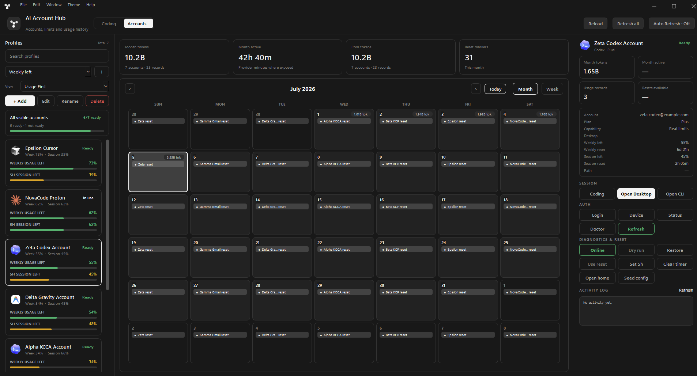
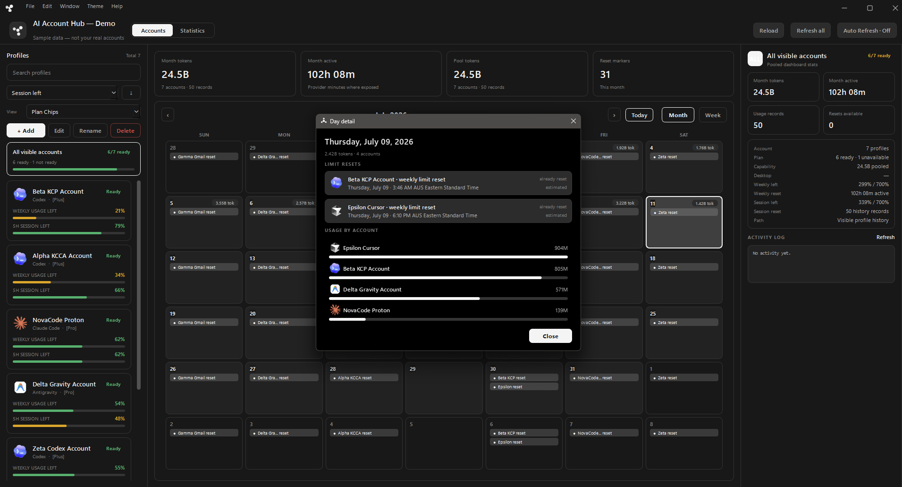
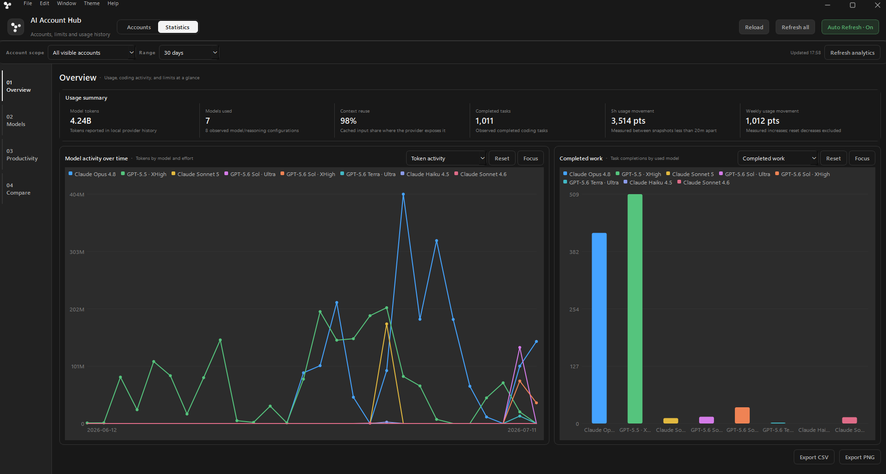
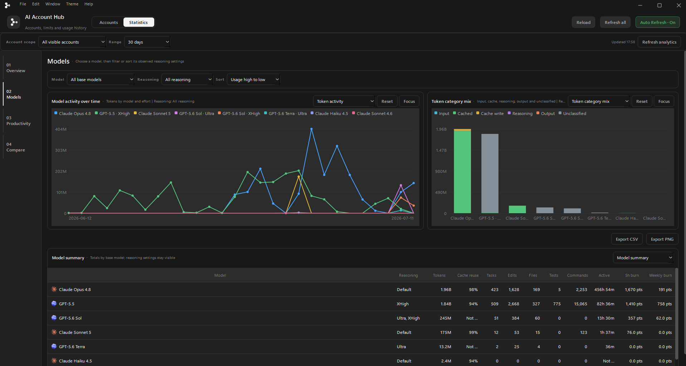
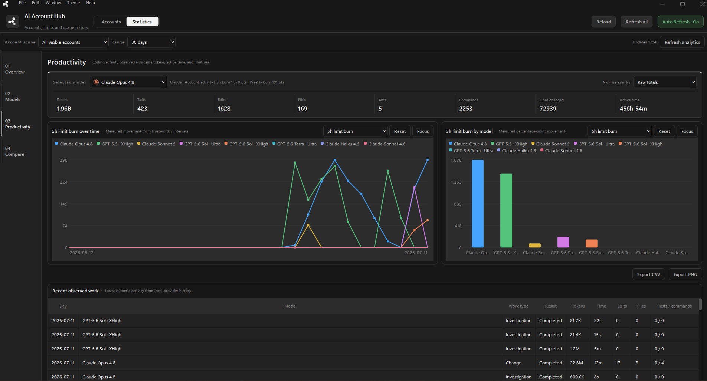
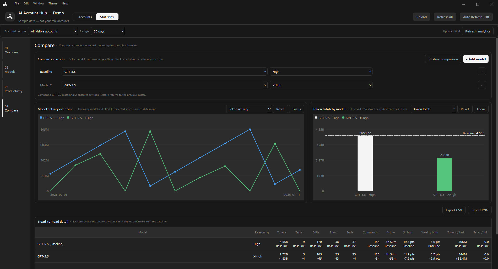
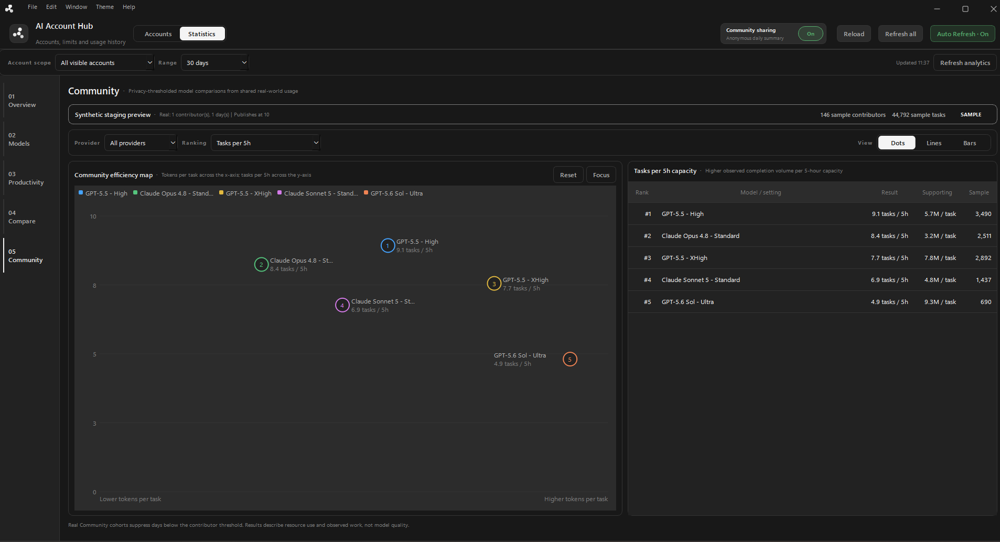
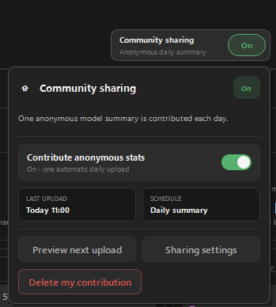
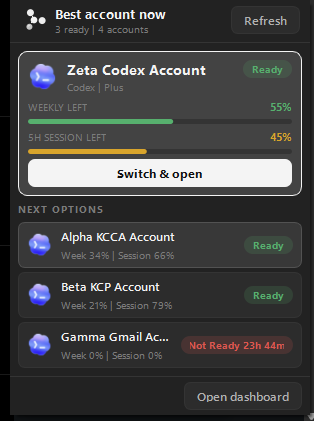
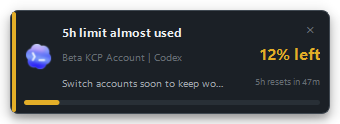

# AI Account Hub

AI Account Hub is a Windows desktop dashboard for people who use more than one
AI coding account. It shows account readiness, session and weekly limits, reset
timing, and local usage history, then launches the official provider tool with
the selected profile active.

The Hub is a passthrough launcher, not another coding harness. Codex, Claude
Code, Cursor, and Antigravity continue to own their authentication, models,
tools, context, updates, and safety prompts.

## Why Not A Proxy Or Pooler?

Proxy and pooling projects usually sit between the user and the provider. They
may expose one shared endpoint, route prompts, merge quota, or become the runtime
that executes requests.

AI Account Hub does none of that. It keeps local profiles isolated, reads the
numeric status that official tools expose, and opens those tools with the chosen
profile. Prompts and responses do not pass through the Hub.

This approach is deliberately narrower:

- No shared API endpoint or merged artificial quota.
- No replacement agent loop or model router.
- No interception of prompts, responses, tool calls, or safety approvals.
- Provider updates remain owned by the official applications and CLIs.
- Accounts can still be used directly outside the Hub.

## Screenshots

Public captures contain no authentication details or real email addresses.
Account views use the built-in sample-data mode; Statistics views expose only
numeric model and activity totals.

### Accounts



The Accounts workspace combines profile readiness, weekly and 5-hour capacity,
reset markers, daily usage, and selected-account actions. Clicking a calendar
day opens the records and resets observed for that date.



### Personal Usage Statistics

| Overview | Models |
|---|---|
|  |  |
| Account-wide model resources and completed work at a glance. | Base-model totals with observed reasoning settings kept available for filtering and comparison. |

| Productivity | Compare |
|---|---|
|  |  |
| Tokens, tasks, edits, files, tests, commands, active time, and trustworthy limit movement remain separate facts. | Two to four model or reasoning selections share one date range, one baseline, zero-based bars, and signed differences. |

**Compare reasoning** temporarily fills the roster with the baseline model's
observed reasoning settings. The workspace shows how many variants are visible
and **Restore comparison** returns to the previous mixed-model roster.

### Community Results

| Community comparisons | Sharing controls |
|---|---|
|  |  |
| Privacy-thresholded model and reasoning cohorts can be explored as data-positioned dots, lines, or vertical bars without producing a universal quality score. | Sharing is off by default and remains inspectable and reversible after opt-in. |

### Background Awareness

| Best Next widget | Signal Rail warning |
|---|---|
|  |  |
| Choose the strongest ready account without reopening the full dashboard. | Receive Hub-styled warnings for low or exhausted limits and notices when accounts become ready again. |

Use **Help > View demo (sample data)** to explore both workspaces without reading
your profiles or usage history.

## Features

- Ready, not-ready, login-needed, error, and active account states.
- Weekly and 5-hour capacity, countdowns, reset markers, and pooled visible-account totals.
- Desktop, CLI, login, status, doctor, refresh, online, and local-profile actions where supported.
- Codex reset-credit visibility and reset action when OpenAI exposes a credit.
- Monthly calendar with per-day token totals, account activity, and weekly-reset events.
- Statistics workspaces for Overview, Models, Productivity, Compare, and Community.
- Independent line-chart and vertical-bar modes with focus, tooltips, PNG export, and CSV export.
- Same-model reasoning comparisons such as High versus XHigh, plus mixed-model comparisons.
- Productivity Density facts without collapsing activity into a quality score.
- Compact Best Next system-tray widget with provider and account visibility settings.
- Signal Rail warnings for low limits, exhausted accounts, and confirmed resets.
- Runtime discovery for provider applications, CLIs, agents, icons, and optional path overrides.
- Built-in dark, light, and accent themes.
- Opt-in signed Community pilot uploads with exact payload preview, daily deduplication, replay protection, receipts, and withdrawal.

## Quick Start

Requirements:

- Windows 10 or newer.
- Python 3.10 or newer.
- Node.js when Codex account-limit probing is required.
- At least one supported provider app or CLI. Missing providers do not block startup.

Download or clone the project, then run:

```bat
Start-AI-Account-Hub.bat
```

The launcher checks Python dependencies and installed providers on every start.
It installs packages from `requirements.txt` when needed, starts the GUI through
`pythonw.exe`, and exits so no CMD window remains in the taskbar.

For troubleshooting, launch with a visible console:

```bat
set AI_HUB_CONSOLE=1
Start-AI-Account-Hub.bat
```

Hidden startup errors are written to:

```text
%USERPROFILE%\.codex-account-launcher\logs\ai-account-hub.log
```

The direct Python entry point is:

```bat
py -3 -m ai_account_hub
```

### Portable Windows Executable

GitHub Actions can build a self-contained Windows x64 folder containing
`AI-Account-Hub.exe`; users do not need to install Python for that artifact.

- Open **Actions > Build Windows executable > Run workflow** for a manual build.
- Download `AI-Account-Hub-Windows-x64` from the completed workflow run.
- Extract the ZIP and run `AI-Account-Hub.exe`.
- Pushing a `v*` tag builds the same artifact and attaches it to a **draft**
  GitHub Release for review before publication.

The executable is not code-signed yet. Windows SmartScreen may show an
unrecognized-app warning on first launch; compare the ZIP against the published
`.sha256.txt` file before running it.

The build remains one-folder rather than one-file so Qt plugins, provider icons,
the Codex limit helper, Help documentation, and screenshots stay available
without extracting the application into a temporary directory on every launch.

## Account Setup

The Hub starts empty on a clean machine. Add only the accounts you intend to
manage. Provider-specific guides are available from **Help > Account setup** and
in the documentation folder:

- [Codex account setup](docs/CODEX_ACCOUNT_SETUP.md)
- [Claude Code account setup](docs/CLAUDE_ACCOUNT_SETUP.md)
- [Cursor account setup](docs/CURSOR_ACCOUNT_SETUP.md)
- [Antigravity account setup](docs/ANTIGRAVITY_ACCOUNT_SETUP.md)

Paid Claude accounts use two official login surfaces when Desktop switching is
required: **Login** authenticates the isolated Claude Code CLI profile, and
**Desktop Login** captures the matching Claude Desktop session. Switching later
restores that captured official state. Logging out inside Claude Desktop can
revoke the session and require Desktop Login again.

## Statistics: What The Data Means

Statistics passively reads numeric metadata exposed by local Codex and Claude
Code history. It can show model and reasoning usage, token categories, completed
tasks, edits, files, tests, commands, active time, and measured movement through
5-hour and weekly limits.

The token-mix chart folds separately exposed reasoning tokens into **Output**
for a fair cross-provider visual. Raw analytics retain the provider's separate
reasoning counter wherever it is available.

It is a personal real-world usage record, not a synthetic benchmark:

- It does not run test prompts or ask for ratings.
- It does not score answer quality.
- Positive or negative comparison values describe resource or activity movement only.
- Every comparison bar starts at zero and represents the observed absolute value.
- Signed labels and table rows show the difference from the selected baseline.
- Models and reasoning settings appear only after they have been observed.

Codex uses one shared local conversation/model timeline while the Hub changes
account authentication. Model names and reasoning settings can therefore be
shared across Codex profiles even when provider quota remains account-specific.
The UI labels inferred attribution rather than presenting it as exact.

See [Real-World Usage Analytics](docs/REAL_WORLD_USAGE_ANALYTICS.md) for metric
definitions, attribution rules, limit-burn safeguards, and the privacy boundary.

### Community Results And Sharing

The fifth Statistics rail section reads privacy-thresholded model aggregates
through the public Community Worker. It provides ranked model/setting results,
provider and date filters, and separate Dots, Lines, and Vertical Bars views.
Rankings use one visible metric at a time; the Hub does not manufacture a
universal quality score. The current public endpoint is a staging pilot and is
labelled as such in the interface.

The fixed **Community sharing** control is off by default. Click the control to
open its compact status panel, preview the next upload, inspect the schedule,
open full settings, or delete a previous contribution. Enabling sharing shows
the exact allowlisted daily payload before anything is sent. The Hub creates a
P-256 installation key protected by Windows DPAPI, signs each request locally,
and sends it only to the Community Worker. D1 enforces installation
registration, one accepted submission per UTC day, nonce replay protection,
and receipts; R2 stores only the anonymous aggregate under a server-generated
private key.

**Edit > Community sharing** opens the same full status and withdrawal flow.
Withdrawal deletes the installation's accepted raw submissions and local
signing identity; turning the switch off merely stops future uploads. Help demo
mode continues to use the offline `test://local` adapter.

Accepted rows automatically update private D1 contribution and daily rollup
tables. A model/reasoning cohort and each visible day require at least 10
distinct installations before they can appear publicly. Until a real cohort
qualifies, the UI clearly labels the existing charts as a synthetic staging
preview and shows real collection progress separately. Signed withdrawal
rebuilds the rollups so deleted contributions disappear from future results.

No Cloudflare credential is packaged, and the desktop rejects direct R2 URLs.
This remains a staging pilot rather than an expert-approved production
leaderboard. Its security model and remaining production gates are documented
in [Community Telemetry And Global Model Comparisons](docs/COMMUNITY_TELEMETRY_SECURITY_PLAN.md).

## Provider Support

| Provider | Desktop | CLI / agent | Local model analytics |
|---|---|---|---|
| Codex | Microsoft Store/AppX package | Store CLI staged under Hub runtime, `codex` on `PATH`, WinGet and user bins | Supported where local history exposes it |
| Claude | Claude Desktop AppX or conventional install | `claude` on `PATH`, native installer, WinGet, npm, or bundled Claude Code | Supported for paid Claude Code history |
| Cursor | Per-user, Program Files, or App Paths installation | `cursor` and the separate `cursor-agent`/`agent` installation | Not exposed reliably |
| Antigravity | Antigravity 2.0 installation | Official standalone `agy` installation | Not exposed reliably |

Some providers do not expose every quota or model field locally. The Hub shows
**Not exposed** instead of inventing a percentage or model attribution.

Official setup sources:

- [Codex documentation](https://learn.chatgpt.com/docs)
- [Claude Code setup](https://code.claude.com/docs/en/getting-started)
- [Cursor documentation](https://cursor.com/docs)
- [Antigravity CLI installation](https://antigravity.google/docs/cli-install)
- [Antigravity downloads](https://antigravity.google/download)

## Provider Discovery

The Windows launcher scans providers before every GUI start. A direct Python
launch runs the same discovery through the engine. Restart the Hub after
installing a provider.

Discovery checks, in order:

1. Valid `AI_HUB_*_PATH` overrides.
2. A runnable Store Codex CLI staged under the Hub runtime.
3. The current process `PATH`.
4. Per-user native installer and package-manager locations.
5. Microsoft Store/AppX, registry, Program Files, and provider bundle locations.
6. A bounded compatibility probe if the shared scanner fails.

The report is written atomically to:

```text
%USERPROFILE%\.codex-account-launcher\provider-discovery.json
```

It contains paths, discovery sources, versions, and warnings. It does not
serialize credentials, cookies, refresh tokens, API keys, conversations, or
account state. Store Codex compatibility staging copies only the installed
package's signed `codex.exe`, never its login or configuration files.

Portable and managed installations can use these overrides:

```text
AI_HUB_CODEX_CLI_PATH          AI_HUB_CODEX_DESKTOP_PATH
AI_HUB_CLAUDE_CLI_PATH         AI_HUB_CLAUDE_DESKTOP_PATH
AI_HUB_CURSOR_CLI_PATH         AI_HUB_CURSOR_AGENT_PATH
AI_HUB_CURSOR_DESKTOP_PATH     AI_HUB_ANTIGRAVITY_CLI_PATH
AI_HUB_ANTIGRAVITY_DESKTOP_PATH
AI_HUB_NODE_PATH               AI_HUB_GIT_PATH
AI_HUB_BROWSER_PATH
```

The complete discovery contract is in
[Provider Discovery](docs/PROVIDER_DISCOVERY.md).

## Local Data And Privacy

Hub-owned runtime data lives outside the repository, primarily under:

- `%USERPROFILE%\.codex-account-launcher`
- `%USERPROFILE%\.codex-accounts`
- `%USERPROFILE%\.ai-account-hub`

Use **File > Local data...** to inspect Hub-managed storage separately from
official provider history. Safe cleanup removes only old numeric analytics rows
and disposable isolated-browser caches. It does not remove account profiles,
cookies, captured desktop sessions, or official Codex and Claude history.

The analytics cache does not retain prompt text, responses, source code, diffs,
command payloads, tool output, raw file paths, email addresses, or account names.

## Platform Support

The 1.1 series is Windows-first. Much of the Qt UI and provider discovery layer
is portable, but process control, packaged-resource paths, state readers, tray
placement, and browser-session handling need native adapters and testing before
macOS or Linux can be called supported.

See [macOS and Linux porting](docs/PORTING_MACOS_LINUX.md) for the standalone
packaging, tray, notification, discovery, and acceptance-test plan.

## Project Documentation

- [Release notes](RELEASE_NOTES.md)
- [Architecture](docs/ARCHITECTURE.md)
- [Provider discovery](docs/PROVIDER_DISCOVERY.md)
- [Real-world usage analytics](docs/REAL_WORLD_USAGE_ANALYTICS.md)
- [Community telemetry security plan](docs/COMMUNITY_TELEMETRY_SECURITY_PLAN.md)
- [macOS and Linux porting](docs/PORTING_MACOS_LINUX.md)

The Windows executable definition lives in
[`packaging/AI-Account-Hub.spec`](packaging/AI-Account-Hub.spec), and the same
build can be run locally with `scripts\build-windows.ps1 -InstallDependencies`.

## License

MIT. See [LICENSE](LICENSE).

This project is not affiliated with OpenAI, Anthropic, Cursor, Google, or any
provider mentioned above.
