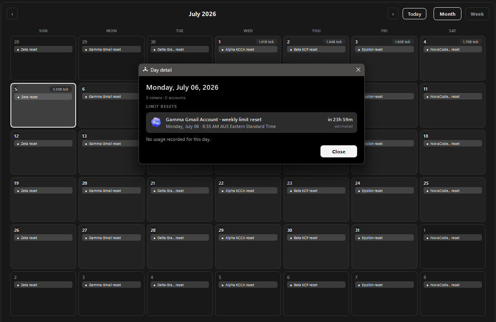
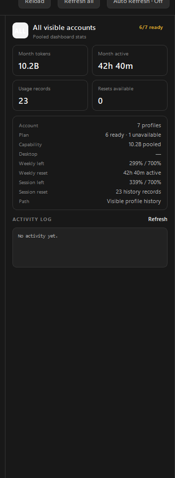
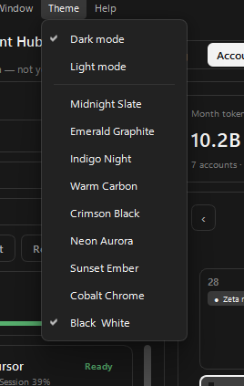

# AI Account Hub

AI Account Hub is a Windows desktop GUI for managing multiple AI coding accounts and launching the official provider tools with the right profile selected. It is designed as a passthrough launcher and dashboard, not a replacement harness.

The app keeps provider behavior owned by the official tools:

- Codex uses the Codex desktop/app-server or CLI profile state.
- Paid Claude accounts use Claude Code profiles. Use **Login** for the
  account's Claude Code CLI profile, then **Desktop Login** only when you want
  the same account captured for Claude Desktop switching.
- Cursor uses Cursor Desktop and Cursor Agent when installed.
- Antigravity uses the installed Antigravity desktop app and a healthy standalone `agy` CLI when exposed.

## Why Not A Proxy Or Pooler?

AI Account Hub does **not** sit between your prompts and the providers. It does
not create a shared API endpoint, proxy traffic, merge accounts into one fake
quota, or replace the provider harnesses you already use.

Instead, it manages isolated local profiles and launches the official apps or
CLIs with the selected profile active. The goal is to make multi-account usage
visible and less error-prone: see which accounts are ready, which are cooling
down, when weekly/session limits appear to reset, and then open Codex, Claude
Code, Cursor, or Antigravity directly with the right local state.

That difference matters because proxy/pooling tools usually become a new
runtime surface. AI Account Hub is intentionally thinner: provider tools keep
their own auth, execution, context, model behavior, updates, and safety prompts.
The Hub is the account dashboard and launcher around them.

## Screenshots

All screenshots below are captured in demo mode, so no real account names,
emails, limits, or tokens are shown.

### Accounts Dashboard


The main dashboard shows provider profiles, ready/not-ready state, weekly usage
left, session usage left, calendar reset markers, and the selected account rail.

### Calendar And Daily Usage

| Usage calendar | Selected day detail |
|---|---|
|  |  |
| The calendar groups daily usage, token totals, and reset markers so you can see when accounts refresh. | Clicking a day opens a focused detail view with that day's records, tokens, active time, and reset events. |

### Account Rail And Themes

| Account detail rail | Theme picker |
|---|---|
|  |  |
| The right rail keeps account actions, auth tools, usage stats, and activity logs together for the selected profile. | Built-in themes let the app switch visual style without changing account data or provider state. |

More images live in [`screenshots/`](screenshots/). Use **Help → View demo
(sample data)** before capturing new screenshots for GitHub.

## Features

- Account dashboard with ready, login-needed, error, and not-ready states.
- Calendar view for usage history and weekly reset markers when providers expose enough data.
- Combined visible-account stats for weekly and session capacity.
- OpenAI/Codex reset-credit visibility and reset action when the provider
  exposes one for the selected account.
- Per-provider account-setup guides in **Help → Account setup** (Claude Code, Codex, Cursor, Antigravity).
- Account actions for desktop, CLI, login, status, doctor, online links, refresh, and local profile folders.
- Claude Code profiles that keep CLI authentication and captured Desktop
  sessions isolated per paid account.
- Runtime icon discovery from installed provider apps, with optional environment overrides.

## Release Status

The Accounts dashboard is the supported public surface for this release. The
native-passthrough Coding workbench is present in the codebase but disabled in
the UI until it is complete.

## Run

Requirements:

- Windows 10 or newer
- Python 3.10 or newer
- Python packages from `requirements.txt` (the launcher installs them when
  needed)
- Node.js when Codex account-limit probing is required
- Any provider apps or CLIs you want to use; missing providers do not prevent startup

Start the GUI:

```bat
Start-AI-Account-Hub.bat
```

Or run it directly:

```bat
py -3 main.py
```

(equivalent to `py -3 -m ai_account_hub`.)

The app is the `ai_account_hub` package: the PySide6 (Qt) front-end is in
`ai_account_hub\ui\`, and the shared, Tk-free backend is in `ai_account_hub\core\`
(`hub_core.py`, `provider_discovery.py`). Native provider transports live in
`ai_account_hub\harness\`.

## Platform support

The app is **Windows-first** today. Provider discovery and all base paths are
already cross-platform (they resolve from `Path.home()` / environment), but the
title bar, desktop/process control, some state readers, and the Windows-only
browser cookie-seeding still need per-OS adapters before macOS/Linux can be
called supported. The full, current porting plan — including the Windows-specific
code inventory and a Windows→macOS→Linux path-mapping table — is in
[`Docs/PORTING_MACOS_LINUX.md`](Docs/PORTING_MACOS_LINUX.md).

## Provider Discovery

`Start-AI-Account-Hub.bat` runs a clean provider scan before every GUI launch. A direct Python launch also scans. The **Reload** command scans again, so tools installed while the hub is open can be picked up without editing `profiles.json`.

Discovery precedence is deterministic:

1. A valid `AI_HUB_*_PATH` environment override
2. The current process `PATH`
3. Per-user native installer locations
4. WinGet, Microsoft Store/AppX, conventional Program Files, and provider bundle locations
5. A compatibility probe if the shared scanner itself fails

An invalid override produces a warning in the discovery report but does not block fallback discovery. Missing providers are represented as missing capabilities; they are never treated as a fatal launcher error.

The Windows scan covers these supported surfaces:

| Provider | Desktop | CLI / agent |
|---|---|---|
| Codex | Microsoft Store/AppX package | `codex` on `PATH`, the Codex app bundle, WinGet/user bins, npm-style user bins |
| Claude | Claude Desktop AppX or conventional install | `claude` on `PATH`, native `~/.local/bin`, WinGet, npm, or Claude Desktop's bundled Claude Code |
| Cursor | `Cursor.exe`, App Paths registry, Program Files, or per-user install | `cursor` plus the separate `cursor-agent`/`agent` installation |
| Antigravity | Antigravity 2.0 per-user or Program Files install | Official `agy` user install, `PATH`, or configured override |

The machine-local result is written atomically to:

```text
%USERPROFILE%\.codex-account-launcher\provider-discovery.json
```

The report contains installation paths, discovery sources, versions, and warnings. It does not read or serialize provider credentials, cookies, refresh tokens, or API keys. To regenerate it manually, run:

```bat
py -3 ai_account_hub\core\provider_discovery.py --write-report
```

### Path Overrides

Use overrides for portable installs, managed machines, custom drives, or provider builds that do not register a normal command:

- `AI_HUB_CODEX_CLI_PATH`
- `AI_HUB_CODEX_DESKTOP_PATH`
- `AI_HUB_CLAUDE_CLI_PATH`
- `AI_HUB_CLAUDE_DESKTOP_PATH`
- `AI_HUB_CURSOR_DESKTOP_PATH`
- `AI_HUB_CURSOR_CLI_PATH`
- `AI_HUB_CURSOR_AGENT_PATH`
- `AI_HUB_ANTIGRAVITY_DESKTOP_PATH`
- `AI_HUB_ANTIGRAVITY_CLI_PATH`
- `AI_HUB_NODE_PATH`
- `AI_HUB_GIT_PATH`
- `AI_HUB_BROWSER_PATH`

Legacy aliases such as `CODEX_CLI_PATH`, `CLAUDE_CODE_PATH`, `CURSOR_PATH`, and `ANTIGRAVITY_PATH` remain accepted. Prefer the `AI_HUB_*` names in new setups because their ownership is unambiguous.

### Official Install Sources

- [Codex documentation](https://developers.openai.com/codex/)
- [Claude Code setup](https://code.claude.com/docs/en/getting-started)
- [Cursor CLI installation](https://docs.cursor.com/en/cli/installation)
- [Antigravity CLI installation](https://antigravity.google/docs/cli-install)
- [Antigravity 2.0 downloads](https://antigravity.google/download)

## Local Data

The app stores local launcher data outside the repository, mainly under:

- `%USERPROFILE%\.codex-account-launcher`
- `%USERPROFILE%\.codex-accounts`
- `%USERPROFILE%\.ai-account-hub`

Provider auth files, browser cookie profiles, local QA captures, lock files, and generated icon caches are intentionally ignored by Git.

Provider icon files are discovered at runtime. You can override them with:

- `AI_HUB_CODEX_ICON_PATH`
- `AI_HUB_CLAUDE_ICON_PATH`
- `AI_HUB_CURSOR_ICON_PATH`
- `AI_HUB_ANTIGRAVITY_ICON_PATH`

## Provider Notes

Some providers do not expose all quota data locally. In those cases the app shows an honest state such as "not exposed by Cursor CLI" or "not reliably exposed yet" instead of fabricating a percentage.

For Claude, see [Claude Account Setup](Docs/CLAUDE_ACCOUNT_SETUP.md). The short
version: choose **Claude Code (paid)**, use **Login** for the isolated Claude
Code CLI profile, then use **Desktop Login** to capture the matching Claude
Desktop session when desktop switching is needed. Switch accounts through the
Hub instead of Claude's in-app **Log out** command; provider logout can revoke
the saved session and require Desktop Login again.

Antigravity structured turns require a healthy standalone `agy` command. If only a broken shim is found, the app opens the native Antigravity desktop fallback and reports the CLI state in the UI.

Discovery proves that an executable exists and, where practical, that `--version` responds. It does not prove that an account is authenticated. Login and usage probes remain profile-specific and are performed through the official provider tools.

No operating-system reboot is required after installing a provider. Restart the
Hub or use **Reload** to run the same clean scan again.

## Development

Useful checks:

```bat
python -m compileall -q ai_account_hub
```

The Qt front-end lives in `ai_account_hub\ui\`; the package layout and internals
are documented in [`Docs/ARCHITECTURE.md`](Docs/ARCHITECTURE.md).

## Porting

This repository is Windows-first today. See [Docs/PROVIDER_DISCOVERY.md](Docs/PROVIDER_DISCOVERY.md) for the discovery contract and [Docs/PORTING_MACOS_LINUX.md](Docs/PORTING_MACOS_LINUX.md) for macOS/Linux contributor instructions.

## License

MIT. See [LICENSE](LICENSE).

This project is not affiliated with OpenAI, Anthropic, Cursor, Google, or any provider mentioned above.
