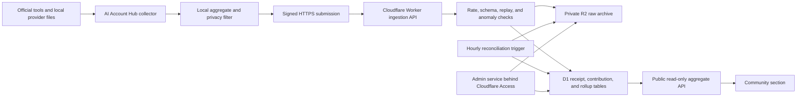

# Community Telemetry And Global Model Comparisons

Security, privacy, integrity, and implementation review plan

Status: Signed privacy-thresholded D1/R2 staging pilot deployed; production rollout remains pending expert review

Date: 12 July 2026

## 1. Executive Decision

AI Account Hub now includes a fifth `Community` section that compares model and
reasoning cohorts using aggregated real-world statistics contributed by opted-in
installations. The current pilot uses a public HTTPS API implemented by a
Cloudflare Worker with D1 and R2 bindings. Queues remain a possible production
extension and are not part of the deployed staging data path.

The desktop application must never receive or contain:

- A Cloudflare API token.
- An R2 access key or secret.
- A D1 administrative credential.
- A Worker deployment token.
- A shared upload secret.
- Provider OAuth tokens belonging to the developer or any other user.

The packaged application contains only the public API URL, public verification
keys, the telemetry schema, and client code. Cloudflare bindings grant the
deployed Worker access to its resources without exposing the underlying secret
to Worker source code or desktop clients.

This system can establish that submissions came from the same pseudonymous
installation and were not changed in transit. It cannot prove that telemetry
from an open-source client is truthful. Public results must therefore be called
`community telemetry`, not provider-verified measurements or synthetic
benchmarks.

## 2. Product Boundaries

### Goals

- Compare models and reasoning settings using passive, real-world usage data.
- Show tokens, limit burn, active time, tasks, edits, tests, commands, files, and
  lines changed where the official provider exposes enough local evidence.
- Let users compare their local results against community medians and ranges.
- Keep provider authentication, prompts, transcripts, source code, and project
  identity on the user's computer.
- Make participation explicit, reversible, inspectable, and disabled by default.
- Keep all Cloudflare credentials outside the public repository and binary.
- Resist replay, duplicate submission, casual fabrication, scraping, denial of
  service, and accidental cost growth.

### Non-goals

- Ranking individual people, accounts, companies, or repositories.
- Measuring answer quality or declaring a universally best model.
- Uploading prompts, responses, tool payloads, diffs, filenames, or source code.
- Proxying provider traffic or handling provider OAuth on the community server.
- Claiming that open-source client telemetry is cryptographically provider
  verified.
- Making community sharing necessary for local statistics or account switching.

## 3. Client Experience And Production Extension

Statistics contains a fifth left-rail `Community` section. The main application
navigation remains Accounts and Statistics. A compact sharing control stays in
the fixed application header on both screens and opens an anchored panel for
state, schedule, preview, settings, and withdrawal. Opening Community does not
enable sharing, and read-only aggregate results remain available before opt-in.

The normal client reads real privacy-thresholded results when a cohort qualifies,
and otherwise shows a clearly labelled synthetic staging preview with separate
real collection progress. It can send explicitly opted-in daily aggregates
through the signed staging Worker. Help demo mode uses
`test://local/community/v1` and makes no network request. Staging is not a public
production leaderboard and remains subject to the review gates below.

The staging pilot currently contains ranked model/setting results, provider and
range filters, Dots, Lines and Vertical Bars views, sample counts, publication
threshold status, and the sharing controls. A production extension may add:

- `Local vs Community`: local value, community median, percentile band, sample
  size, and observation window.
- `Model Leaderboard`: models and reasoning settings ranked by selected resource
  or observable-work metric.
- `Limit Economics`: typical work and tokens per 5-hour and weekly capacity
  point.
- `Productivity Density`: separate observable counts, never one quality score.
- `Cohorts`: provider, model, reasoning, plan class, time range, and minimum
  sample-quality filters.
- `Data Quality`: observed, inferred, excluded, low sample, and suspected outlier
  labels.
- `Sharing`: off/on, exact preview, last upload, pending records, withdraw, and
  delete contribution controls.

Public rankings are model-level only. The API never exposes installation-level
rows, account-level rows, or a list of contributors.

## 4. Trust Boundaries And Data Flow



Trust boundaries:

1. Provider data to local collector: local-machine trust boundary.
2. Local collector to privacy filter: application correctness boundary.
3. Desktop client to Worker: hostile Internet and hostile-client boundary.
4. Worker to Queue, R2, and D1: Cloudflare binding boundary.
5. Public aggregate API: untrusted reader and scraping boundary.
6. Administration: privileged operator boundary.

## 5. Threat Model

| Threat | Primary risk | Required control |
| --- | --- | --- |
| Secret extracted from the executable | Cloudflare account compromise | No shared or administrative secret in any client build |
| Fabricated telemetry | Misleading community results | Validation, trust tiers, robust statistics, quarantine, sample counts |
| Replayed valid submission | Inflated totals | Signed timestamp and nonce, body hash, D1 nonce and daily uniqueness |
| Duplicate queue delivery | Double counting | Idempotent consumer and unique submission primary key |
| Oversized or deeply nested payload | Worker cost or denial of service | Small body cap, strict schema, depth and array limits |
| Automated registration flood | Storage and compute cost | Registration quota, proof of key possession, abuse monitoring |
| Endpoint scraping | Cost and dataset extraction | Cached aggregate responses, bounded filters, pagination, rate limits |
| SQL injection | D1 disclosure or corruption | Fixed queries, prepared statements, allowlisted sort/filter values |
| Object-key manipulation | R2 overwrite or disclosure | Server-generated keys only; no client-supplied R2 paths |
| Small-cohort re-identification | Privacy harm | Minimum contributor threshold and suppressed sparse cohorts |
| Accidental content collection | Source or conversation disclosure | Deny-by-default telemetry builder and forbidden-field tests |
| Compromised CI token | Cloudflare deployment compromise | Least-privilege token, protected environment, rotation, audit logs |
| Compromised admin session | Dataset modification or disclosure | Separate admin service, Cloudflare Access, MFA, read-only defaults |
| Software bug causes cost spike | Unexpected bill | Cloudflare budget alerts, quotas, payload limits, kill switch |
| User withdraws consent | Continued unwanted processing | Immediate local stop plus signed deletion workflow |

The review should map these controls against the OWASP API Security Top 10,
especially unrestricted resource consumption, broken object authorization,
security misconfiguration, and unsafe API consumption.

## 6. Telemetry Data Contract

### Allowed fields

All fields use a versioned, deny-by-default schema. Recommended first version:

```json
{
  "schemaVersion": 1,
  "submissionId": "random UUID",
  "periodStartUtc": "2026-07-06T00:00:00Z",
  "periodKind": "day",
  "provider": "codex",
  "model": "gpt-5.5",
  "reasoning": "xhigh",
  "attribution": "observed",
  "planClass": "paid",
  "tokens": {
    "total": 184000000,
    "input": 10000000,
    "cached": 160000000,
    "reasoning": 12000000,
    "output": 2000000
  },
  "activity": {
    "tasks": 42,
    "edits": 318,
    "files": 28,
    "tests": 17,
    "commands": 126,
    "linesChanged": 4700,
    "activeMinutes": 604
  },
  "limits": {
    "sessionBurnPoints": 81.0,
    "weeklyBurnPoints": 14.0
  },
  "collector": {
    "appVersion": "1.1",
    "collectorVersion": 1,
    "platform": "windows"
  }
}
```

Data is aggregated locally into daily or weekly records. Per-message and
per-tool-call timing must not be uploaded because detailed event timing can
fingerprint a person's working schedule.

### Permanently forbidden fields

- Account email, account UUID, provider user ID, display name, or profile name.
- Provider access token, refresh token, session cookie, API key, or auth file.
- Prompt, response, transcript, tool arguments, tool output, or reasoning text.
- Source code, diff content, command arguments, terminal output, or attachments.
- Repository name, remote URL, branch, commit hash, issue ID, or project name.
- File or directory name, absolute path, working directory, or machine username.
- Computer name, Windows SID, MAC address, disk serial, IP address, or location.
- Raw session ID, conversation ID, provider request ID, or browser profile data.
- Exact event timestamps finer than the agreed aggregation period.

The client must build a new allowlisted object rather than redact an existing
history object. Redaction is not a safe primary control because new local fields
can be added later and accidentally bypass it.

## 7. Consent And Privacy Controls

Community sharing is off by default. The enable screen must state, in plain
language:

- What numeric fields will be sent.
- Why they are sent.
- How often they are sent.
- How long raw and aggregate records are retained.
- That results are community telemetry and may contain fabricated submissions.
- That account credentials, prompts, code, filenames, and project identity are
  not sent.
- How to inspect the next payload, pause sharing, withdraw, and delete data.

Required controls:

1. `Preview next upload` displays the exact canonical JSON body.
2. `Enable community sharing` requires an unchecked explicit consent control.
3. Consent version and time are stored locally, not used as a public identifier.
4. A material schema or purpose change requires renewed consent.
5. `Pause` immediately stops network submission while retaining the local queue.
6. `Withdraw` stops submission and clears the local pending queue.
7. `Delete my contribution` performs a signed server deletion request.
8. The local application remains fully useful with sharing disabled.

Proposed retention for expert review:

- Pending local telemetry: 30 days maximum.
- Raw R2 submissions: 30 days maximum.
- Quarantined submissions: 14 days maximum.
- Aggregated D1 cohort data: 24 months maximum.
- Inactive installation public keys: delete after 12 months.
- Security audit events: 90 days, excluding request bodies.
- Deletion tombstones: minimal hash and completion time for 30 days.

These are proposed engineering defaults, not a legal conclusion. A privacy
review must decide whether pseudonymous installation identifiers and model-use
patterns are personal information in each supported jurisdiction. The OAIC
guidance emphasizes express, current, specific consent and collecting only data
reasonably necessary for the stated purpose.

## 8. Anonymous Installation Identity

### Why no shared API key

Any secret shipped in an open-source desktop application can be recovered and
reused. Obfuscation, compiling to an executable, Cloudflare Access service
tokens, or a shared bearer token do not solve this problem.

### Recommended protocol

1. On opt-in, generate an ECDSA P-256 key pair locally with the `cryptography`
   library and operating-system entropy.
2. On Windows, encrypt the PKCS#8 private key with user-scoped DPAPI before it is
   written to the machine-local Hub folder. macOS Keychain and Linux Secret
   Service adapters remain required before those ports can upload.
3. If no secure store is available, disable upload instead of writing the
   private key into `profiles.json`, logs, or a plaintext configuration file.
4. Register only the public key through `POST /v1/installations`.
5. The installation ID is the first 128 bits of SHA-256 over the public SPKI. It
   is pseudonymous and deterministic for that key, not a hardware fingerprint.
6. Registration signs `AIH1-REGISTER`, the public key, timestamp, and nonce.
   Every later action signs this canonical request string:

```text
AIH1
HTTP_METHOD
API_PATH
INSTALLATION_ID
UNIX_TIMESTAMP
NONCE
SHA256_EXACT_BODY
```

7. Send the installation ID, timestamp, nonce, exact body hash, and signature in
   headers. ECDSA signatures use the fixed 64-byte IEEE-P1363 `r || s` form.
8. The Worker rejects timestamps outside a short window, invalid signatures,
   reused nonces, modified bodies, and duplicate daily periods.
9. Signed withdrawal deletes accepted raw R2 objects and installation-scoped D1
   rows before the client removes its local identity. Key rotation and recovery
   remain future work; a lost key cannot authorize deletion of its old identity.

This protocol provides proof of possession and replay resistance. It does not
make locally generated numbers trustworthy or stop the computer owner from
extracting their own private key.

## 9. Cloudflare Architecture

### Public ingestion Worker

Responsibilities:

- Terminate HTTPS at a dedicated API hostname.
- Accept only documented methods, routes, media types, and schema versions.
- Enforce a small compressed and uncompressed body limit.
- Verify signatures before parsing expensive fields or touching storage.
- Validate all numbers for type, range, finite value, and cross-field sanity.
- Apply Cloudflare rate limiting keyed primarily by installation ID.
- Apply exact daily submission quotas and replay constraints in D1.
- Generate all R2 object keys server-side.
- Enqueue accepted records and return `202 Accepted` with a receipt ID.
- Return stable error codes without internal stack traces or binding details.

Cloudflare's rate-limiting binding is fast but intentionally permissive and
eventually consistent. It must be a protective layer, not the exact quota or
accounting system. Exact deduplication and daily quotas belong in D1.

### Queue consumer

- Treat Queue delivery as at least once.
- Use `submissionId` as an idempotency key and D1 primary or unique key.
- Write the accepted raw record to private R2 using a server-generated path.
- Update D1 aggregates in an idempotent transaction or deterministic upsert.
- Send permanently failing messages to a dead-letter queue.
- Never log complete message bodies.

Cloudflare documents that Queues can occasionally deliver a message more than
once and recommends unique IDs or idempotency keys for deduplication.

### R2 raw archive

- Use a new dedicated bucket, separate from release files and backups.
- Keep `r2.dev` and public custom-domain access disabled.
- Permit access only through a Worker binding.
- Store compressed JSON objects under server-generated, non-public keys.
- Apply lifecycle deletion matching the approved raw-retention period.
- Store no secrets or provider authentication material.
- Use object metadata only for schema version, receipt ID, and ingestion time.

Cloudflare states that R2 buckets are private by default and objects and metadata
are automatically encrypted at rest. Privacy still depends on application
authorization and not enabling a public bucket endpoint.

### D1 query and aggregation database

Implemented staging tables:

- `installations`: pseudonymous ID, public key, state, and activity times.
- `submissions`: receipt, installation, UTC day, private R2 key, body hash, and count.
- `nonces`: short-lived replay records.
- `daily_contributions`: installation/model/reasoning numeric allowlist per UTC day.
- `daily_model_rollups`: daily totals, observations, and distinct contributor count.

Still proposed for production hardening:

- `published_cohorts`: precomputed public medians, ranges, and sample counts.
- `deletion_jobs`: signed deletion request and completion status.
- `security_events`: bounded metadata-only events.
- `schema_versions`: accepted versions and retirement dates.

All queries use prepared statements. Public filter and sort fields map to fixed
server-side enums. No API request can provide SQL, table names, column names, or
an R2 object key.

### Public query Worker

Use a separate read-only Worker or service binding where practical:

- Read only from precomputed public cohort rows.
- Return no installation ID or raw submission.
- Require a minimum unique-contributor threshold before publishing a cohort.
- Bound date ranges, page sizes, model lists, and response sizes.
- Cache popular responses and provide ETags.
- Use a public schema that cannot accidentally serialize private D1 columns.

### Administration

- Put administration on a separate hostname and Worker.
- Protect it with Cloudflare Access and phishing-resistant MFA.
- Grant no administrative route through the public desktop API.
- Separate read, quarantine, deletion, and deployment roles.
- Record administrative actions without recording telemetry bodies.
- Require confirmation and an audit event for destructive operations.

## 10. Leaderboard Integrity And Statistical Safety

The system should publish distributions rather than a single winner score:

- Median and interquartile range.
- 10th and 90th percentile where the cohort is large enough.
- Unique contributing installations.
- Number of accepted periods.
- Observed versus inferred attribution percentage.
- Exclusion and quarantine percentage.
- Data freshness and collector-version coverage.

Recommended publication rules for review:

- Suppress cohorts with fewer than 10 unique installations.
- Require observations across at least three separate UTC days.
- Do not publish a cohort dominated by one installation.
- Separate model reasoning levels instead of silently combining them.
- Keep provider-exposed and locally inferred attribution visibly separate.
- Use robust statistics and display outliers rather than letting one value define
  the scale.
- Never convert productivity-density facts into an unsupported quality score.
- Never call the result provider verified.

Anomaly checks should quarantine rather than silently rewrite raw submissions:

- Negative values, non-finite numbers, or impossible percentages.
- Counter decreases inside one cumulative period without a reset marker.
- Implausible token-to-event ratios.
- Repeated identical payloads across many installation IDs.
- Sudden high-volume registration and submission clusters.
- Unsupported models, providers, reasoning settings, or collector versions.

The public API can expose an `included`, `excluded`, and `quality` count so users
and reviewers can understand how much filtering occurred.

## 11. Secret And Configuration Management

Repository rules:

- Commit only `wrangler.example.jsonc` or a non-secret base configuration.
- Ignore `.dev.vars`, `.env`, generated production configuration, local Wrangler
  state, service tokens, private keys, and downloaded data exports.
- Run secret scanning before every release and in CI.
- Treat account IDs, database IDs, and bucket names as deployment metadata even
  though they are not authentication secrets; avoid publishing personal naming.

Cloudflare rules:

- Use bindings for R2, D1, Queue, and rate limiting.
- Use Wrangler secrets or Cloudflare Secrets Store for actual secret values.
- Create separate staging and production Workers, buckets, databases, queues,
  domains, and secrets.
- Use a least-privilege deployment token restricted to the required account and
  resources.
- Rotate deployment and administrative credentials after suspected exposure.

GitHub Actions rules:

- Store the scoped Cloudflare deployment token and account ID in the protected
  GitHub environment, not repository files.
- Require manual approval for production deployment.
- Pin third-party Actions to immutable commit SHAs.
- Do not expose secrets to pull requests from forks.
- Generate deployment-specific binding configuration only inside CI.
- Retain deployment provenance and the Worker version associated with a release.

## 12. API Surface

Proposed version-one routes:

| Route | Purpose | Authorization |
| --- | --- | --- |
| `GET /v1/schema` | Accepted schema and client compatibility | Public, cached |
| `POST /v1/installations` | Register public key and prove possession | Signed by submitted key, tightly limited |
| `POST /v1/submissions` | Submit one aggregate period | Installation signature |
| `GET /v1/submissions/{id}` | Receipt status only | Installation signature |
| `DELETE /v1/installations/me` | Withdraw and start deletion | Installation signature |
| `GET /v1/community/models` | Published model aggregates | Public, cached, bounded |
| `GET /v1/community/compare` | Published cohort comparison | Public, cached, bounded |
| `GET /v1/health` | Non-sensitive availability | Public, minimal |

The final OpenAPI document must define maximum string lengths, numeric ranges,
array counts, response shapes, error codes, and whether every property is
required. Unknown request properties should be rejected, not ignored.

## 13. Deletion Design

Deletion must be designed before collection begins.

1. The client signs a deletion request with its installation private key.
2. The Worker immediately revokes further writes for that installation.
3. A deletion job identifies D1 rows and R2 object keys using the private
   installation partition.
4. Raw R2 objects and submission rows are removed.
5. Affected cohort aggregates are recomputed or adjusted from retained aggregate
   contributions.
6. Public cached results are purged after recomputation.
7. A receipt reports pending, complete, or failed without exposing deleted data.
8. Only a minimal time-bounded tombstone remains to prevent replay during the
   deletion window.

Backups and point-in-time recovery need a documented deletion limitation. D1
Time Travel can restore prior database states, so operational procedures must
prevent deleted records from being accidentally republished after a restore.

## 14. Logging, Monitoring, And Incident Response

Safe logging:

- Log request ID, route, status, latency, schema version, byte count, and coarse
  failure category.
- Hash or truncate installation IDs in operational logs.
- Never log request bodies, signatures, provider data, authorization headers,
  R2 contents, or complete D1 rows.
- Sample successful events; retain security failures only as long as necessary.

Required alerts:

- Registration or submission volume anomaly.
- Rejection, signature failure, replay, and quarantine spikes.
- Queue backlog, retry, and dead-letter growth.
- D1 write or migration failure.
- R2 object growth beyond forecast.
- Public API latency or error-rate regression.
- Cloudflare billing threshold and unexpected resource growth.
- Production secret, binding, route, or deployment change.

Incident capabilities:

- Global upload kill switch while keeping read-only results available.
- Schema-version kill switch.
- Per-installation revocation and per-model quarantine.
- Rollback to a known Worker deployment.
- D1 point-in-time recovery procedure and post-restore deletion reconciliation.
- Credential rotation runbook.
- User-facing incident notice process where required.

## 15. Verification Plan

### Client tests

- Telemetry builder emits only allowlisted fields.
- Forbidden marker strings such as emails, drive paths, OAuth keys, prompt text,
  and repository URLs can never survive serialization.
- Sharing is disabled by default on clean install and upgrade.
- Preview body exactly matches the signed and transmitted body.
- Consent withdrawal stops networking immediately.
- Private key never appears in profiles, settings, logs, crash reports, or export.
- Missing secure credential storage causes upload to fail closed.
- Offline queue is encrypted or contains only already-safe aggregates.

### Cryptographic and protocol tests

- Valid signature succeeds.
- Modified body, route, method, installation ID, timestamp, or nonce fails.
- Expired timestamps, duplicate nonces, and duplicate daily periods fail safely.
- Key rotation and lost-key behavior match the documented contract.
- Canonical JSON and request signing produce identical bytes across platforms.
- Randomness comes from operating-system cryptographic entropy.

### API security tests

- Fuzz malformed JSON, nested objects, huge numbers, NaN, Infinity, Unicode,
  duplicate properties, compression bombs, and wrong content types.
- Verify strict body, response, date-range, pagination, and execution limits.
- Test object authorization for every installation-scoped endpoint.
- Attempt SQL injection in every filter and sort field.
- Attempt R2 path traversal, object overwrite, and arbitrary read.
- Verify public routes cannot return raw or installation-level data.
- Verify rate limiting, exact quotas, idempotency, and queue redelivery.
- Test error responses for stack traces, binding names, and identifiers.
- Review against the OWASP API Security Top 10.

### Cloud and deployment tests

- R2 bucket has no `r2.dev` or public custom-domain access.
- Worker uses bindings instead of Cloudflare REST credentials at runtime.
- Staging cannot access production resources.
- Fork pull requests cannot access deployment secrets.
- CI artifacts, executable, source archive, and Git history pass secret scanning.
- Production deployment requires approval and produces auditable provenance.
- Restore, deletion, queue failure, and kill-switch exercises succeed.

### Privacy and statistical tests

- Sparse cohorts remain suppressed.
- Public responses contain no stable contributor identifier.
- One contributor cannot dominate a published cohort.
- Local versus community calculations disclose sample size and attribution type.
- Deleting an installation removes it from future published aggregates.
- Retention jobs delete expired raw objects and rows.
- A privacy reviewer approves the consent, notice, retention, and cross-border
  processing position before public collection.

## 16. Rollout Plan And Security Gates

### Phase 0: Expert design review

Deliver threat model, data inventory, example payload, OpenAPI draft, retention
proposal, Cloudflare topology, and unresolved decisions. No cloud resources and
no client networking are introduced.

Gate: written approval from application-security, privacy, Cloudflare, and
statistics reviewers.

### Phase 1: Read-only Community UI

Build the fifth section against a static local fixture. Finalize labels, sample
quality, cohort suppression, and accessibility without collecting data.

Gate: UI cannot enable or imply active sharing.

Implementation status: complete for the offline Help demo fixture. The normal
application now uses the separately identified signed staging transport.

### Phase 2: Local privacy pipeline

Implement the allowlisted aggregate builder, preview, consent state, secure key
storage, offline queue, and forbidden-field tests. Use a local fake server only.

Gate: privacy test corpus and secret scan pass on a clean machine.

Implementation status: aggregate allowlisting, exact preview, consent state,
forbidden-field tests, local fake endpoint, DPAPI-protected P-256 identity, and
non-blocking signed transport are complete. An encrypted offline queue is not
implemented; failed uploads remain due and retry later without writing payloads
to a plaintext queue.

### Phase 3: Isolated Cloudflare staging

Deploy the staging Worker with D1, private R2, rate limits, and reconciliation.
Evaluate Queue and dead-letter processing before any production environment.

Gate: API, replay, authorization, fuzz, deletion, restore, and cost tests pass.

Implementation status: the Worker, private `TELEMETRY_BUCKET` binding, D1 schema,
P-256 registration and request verification, timestamp and nonce replay checks,
exact daily idempotency, rate-limit bindings, server-generated R2 keys, receipts,
signed withdrawal, private contribution rows, daily model/reasoning rollups,
10-installation cohort/day suppression, automatic publication, and hourly
reconciliation are deployed to isolated staging. Local tests proved the
pending-to-public threshold transition and removal after withdrawal. Queues,
retention automation, recovery drills, fuzzing, cost controls, independent
review, and a production environment remain pending.

### Phase 4: Closed opt-in pilot

Enable sharing only for invited testers. Publish no public leaderboard until
cohort thresholds and integrity controls are validated.

Gate: privacy review, incident drill, deletion drill, retention verification,
and independent security review pass.

Implementation status: in progress with the release owner as the initial
participant. The client is explicit opt-in, exact payload preview and signed
withdrawal are active, and real cohorts remain suppressed below 10 distinct
installations. This does not satisfy the production gate.

### Phase 5: Public read-only aggregates

Publish only qualifying model-level cohorts. Keep uploads behind a feature flag
and preserve the global kill switch.

Gate: no high-severity review findings and no unresolved data-leak findings.

### Phase 6: Public opt-in release

Enable voluntary uploads with clear consent and exact payload preview. Monitor
cost, abuse, quality, and deletion continuously.

Gate: release owner signs the production checklist and records accepted residual
risks.

## 17. Required Expert Review Packet

Provide reviewers with:

1. This document and a versioned decision log.
2. Data-flow and trust-boundary diagrams.
3. STRIDE-style threat model and control mapping.
4. Complete telemetry JSON Schema with allowed ranges.
5. Complete forbidden-data inventory.
6. OpenAPI specification and example signed requests.
7. Key generation, storage, rotation, recovery, and deletion design.
8. Cloudflare `wrangler.example.jsonc` and binding topology.
9. D1 schema, migrations, prepared queries, and row-level data classification.
10. R2 lifecycle, privacy, backup, restore, and deletion behavior.
11. Consent text, privacy notice, retention schedule, and data deletion process.
12. Anomaly, cohort-threshold, and statistical-publication rules.
13. CI/CD permissions, secret handling, dependency policy, and release provenance.
14. Test results, fuzzing report, secret-scan report, and dependency scan.
15. Incident, rollback, key-rotation, kill-switch, and cost-control runbooks.
16. List of known limitations and explicitly accepted residual risks.

Recommended reviewers:

- Desktop application security engineer.
- Cloudflare Workers, D1, R2, and Queues engineer.
- Applied cryptography reviewer.
- Privacy counsel or qualified privacy practitioner.
- Data scientist familiar with robust statistics and adversarial telemetry.
- Independent penetration tester before public opt-in release.

## 18. Questions For Reviewers

1. Is a pseudonymous installation public key necessary, proportionate, and
   appropriately treated as potentially personal information?
2. Is ECDSA P-256 plus DPAPI appropriate for Windows, which Keychain/Secret
   Service adapters should other platforms use, and is failing closed acceptable?
3. Is the six-line canonical signing format complete and unambiguous?
4. Are daily aggregates coarse enough to prevent work-schedule fingerprinting?
5. Should plan class and platform be removed or coarsened further?
6. Is 10 unique installations a sufficient publication threshold?
7. Are the raw and aggregate retention periods justified by the product purpose?
8. Can deletion be honored across D1 recovery and R2 backup procedures?
9. Are D1 exact quotas sufficient, or is strongly consistent per-installation
   state required?
10. Are anomaly rules transparent enough without teaching attackers how to evade
    them?
11. Does the public wording avoid misleading benchmark or provider-verification
    claims?
12. Are cross-border processing, Cloudflare terms, and user notices adequate?
13. Are the deployment token and administration roles sufficiently constrained?
14. What residual fabrication risk is acceptable for community telemetry?

## 19. Go-Live Acceptance Criteria

The feature is not ready for production unless all statements are true:

- No Cloudflare or provider secret exists in source, Git history, release assets,
  executable strings, configuration defaults, screenshots, logs, or tests.
- A clean installation has community sharing disabled.
- Users can inspect the exact upload and use all local features without sharing.
- Only allowlisted aggregates can cross the network boundary.
- Public APIs cannot access installation-level or raw records.
- Private R2 access is confirmed and public bucket access is disabled.
- Replay, duplicate, malformed, oversized, unauthorized, and abusive submissions
  are handled safely.
- Cohort suppression and statistical-quality labels are enforced server-side.
- Deletion, retention, restore, rollback, and kill-switch procedures are tested.
- Cost alerts and hard operational limits are active.
- Staging and production resources and credentials are separated.
- Independent reviewers have no unresolved critical or high-severity findings.
- Privacy and security documentation is published before opt-in collection.

## 20. Residual Risks That Must Be Disclosed

- Open-source clients can fabricate telemetry; signatures do not prove truth.
- Pseudonymous usage patterns may still be identifying when combined with other
  information, especially in small cohorts.
- Provider format changes can cause incorrect local attribution.
- Community results reflect participating users and are not representative of
  every model user.
- Cloud service compromise and operator mistakes cannot be reduced to zero.
- Deletion from live systems may not immediately remove data from time-limited
  disaster-recovery history.
- Rate limits and anomaly detection reduce abuse but do not eliminate it.

These limitations should appear in the product documentation and Community
section, not only in internal security material.

## 21. Reference Material

- [Cloudflare Workers bindings](https://developers.cloudflare.com/workers/runtime-apis/bindings/)
- [Cloudflare Workers best practices](https://developers.cloudflare.com/workers/best-practices/workers-best-practices/)
- [Using R2 from Workers and securing bucket operations](https://developers.cloudflare.com/r2/api/workers/workers-api-usage/)
- [R2 public bucket behavior](https://developers.cloudflare.com/r2/buckets/public-buckets/)
- [R2 data security](https://developers.cloudflare.com/r2/reference/data-security/)
- [D1 query guidance](https://developers.cloudflare.com/d1/best-practices/query-d1/)
- [D1 Time Travel and recovery](https://developers.cloudflare.com/d1/reference/time-travel/)
- [Cloudflare Queues delivery guarantees](https://developers.cloudflare.com/queues/reference/delivery-guarantees/)
- [Cloudflare Workers rate limiting](https://developers.cloudflare.com/workers/runtime-apis/bindings/rate-limit/)
- [Cloudflare Secrets Store](https://developers.cloudflare.com/secrets-store/integrations/workers/)
- [OWASP API Security Top 10](https://owasp.org/API-Security/editions/2023/en/0x03-introduction/)
- [OAIC Australian Privacy Principles guidelines](https://www.oaic.gov.au/privacy/australian-privacy-principles/australian-privacy-principles-guidelines)
- [NIST Privacy Framework](https://www.nist.gov/privacy-framework)
