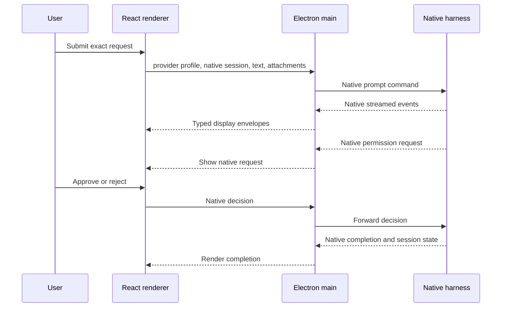

# Native Harness Workbench

## Corrected passthrough architecture and implementation plan

Date: 2026-07-01

## Clarified requirement

The application must not become another coding harness.

It should be one front-facing desktop client that opens and controls the
harnesses the user already uses:

- Codex
- Claude Code
- Cursor Agent
- Gemini CLI
- Antigravity
- optionally OpenCode and other ACP-compatible agents

Each provider remains responsible for:

- the agent loop
- system prompts
- project instructions
- context collection
- compaction
- tool definitions
- tool execution
- permissions and sandboxing
- subagents
- models
- native conversation history
- provider authentication
- provider usage and billing

The Workbench is responsible only for:

- discovering installed harnesses
- selecting an account/profile
- starting the native command or official programmatic surface
- sending user input without rewriting it
- forwarding native approval decisions
- displaying native events
- listing native histories
- resuming native sessions
- arranging projects and tabs in one GUI
- showing account and quota observations
- managing process lifecycle

This is a **multi-harness client** or **native harness console**. It is not an
orchestrator and not an agent framework.

## Correction to the T3 Code recommendation

The previous recommendation to fork T3 Code wholesale was too broad.

T3 Code is useful research and contains excellent work, but its server does
more than this product should own:

- a provider abstraction
- a canonical orchestration event model
- command and event reactors
- its own SQLite event projections
- checkpoint and diff orchestration
- provider-session bindings
- provider-independent thread behavior

From the clarified product perspective, that makes it an additional harness
layer even though it still launches native providers underneath.

### What can still be reused

Because T3 Code is MIT licensed, selected frontend ideas or isolated components
can be reused with attribution:

- three-pane layout
- virtualized thread list
- markdown rendering
- tool-call presentation
- diff viewer
- terminal component
- provider and model picker design
- responsive desktop layout

### What should not be the foundation

- T3 orchestration engine
- T3 canonical thread state
- T3 provider command reactor
- T3 checkpoint reactor
- T3 event-sourced provider normalization
- T3 provider-owned continuation rules
- T3 remote relay and cloud authentication

The new application should use a much smaller Electron main process and direct
native transports.

## Ownership boundary

| Concern | Native harness owns it | Workbench owns it |
|---|---:|---:|
| Agent reasoning loop | Yes | No |
| Tools and commands | Yes | No |
| System prompt | Yes | No |
| Repo instructions and skills | Yes | No |
| Context and compaction | Yes | No |
| Permissions and sandbox | Yes | No |
| Native conversation | Yes | No |
| Authentication | Yes | No |
| Model availability | Yes | No |
| Provider updates | Yes | No |
| Start/stop child process | No | Yes |
| Account-specific environment | No | Yes |
| Native protocol transport | No | Yes |
| Render streamed events | No | Yes |
| Project and tab arrangement | No | Yes |
| Cross-provider thread index | No | Yes |
| Quota dashboard | No | Yes |
| Disposable display cache | No | Yes |

The Workbench may translate wire messages into view components. It must not
translate one provider's behavior into another provider's behavior.

## Product behavior

### Projects

The left side lists local project folders. Expanding a project shows native
threads grouped by harness:

```text
My Project
  Codex
    Fix authentication timeout
    Review billing changes
  Claude Code
    Refactor API client
  Cursor
    Investigate test failure
```

These are references to native provider sessions, not copies rewritten into a
Hub conversation format.

### Threads

Opening a thread:

1. Resolves the provider profile and native session ID.
2. Starts the provider's official local command or SDK.
3. Requests the provider to load or resume its own session.
4. Displays the provider's returned history and live events.
5. Sends follow-up requests directly to that native session.

A thread cannot silently change harness. To ask another harness, create another
native thread under the same project.

### Composer

The composer sends:

- the exact user text
- provider-supported attachments
- provider-supported settings explicitly selected in the UI

It does not prepend:

- a Hub system prompt
- a synthesized transcript
- hidden provider-routing instructions
- a universal tool schema
- a model identity prompt

### Account selection

An account is selected before a native thread starts.

Once a thread exists, its provider profile is visible and fixed unless the
native harness explicitly supports resuming that session with another profile.
The Workbench should usually require a new native thread for a different
account.

## Recommended application architecture

```text
+-------------------------------------------------------------------+
| Electron renderer: React                                           |
| Projects | Native threads | Native conversation | Account status   |
+-------------------------------+-----------------------------------+
                                | narrow typed IPC
+-------------------------------v-----------------------------------+
| Electron main process                                              |
|                                                                    |
| NativeProcessManager                                               |
| ProfileEnvironmentResolver                                         |
| NativeHistoryIndex                                                 |
| DisposableRenderCache                                              |
| AccountUsageObserver                                               |
|                                                                    |
| No agent loop, no tool engine, no canonical conversation runtime   |
+---------+----------------+----------------+-------------------------+
          |                |                |
          v                v                v
  codex app-server   claude stream/SDK   agent acp
  native Codex       native Claude Code  native Cursor Agent
          |
          +---- gemini stream-json / agy PTY or supported SDK
```

### Why Electron

Electron is appropriate here because its main process can directly:

- spawn Windows child processes
- maintain stdio and JSON-RPC streams
- host PTY sessions
- set per-process environment variables
- isolate secrets from the renderer
- use the existing React ecosystem for threads, markdown, diff, and terminal UI

No localhost web server is required for the personal desktop build. The
renderer communicates through a narrow preload IPC API.

### Main-process services

#### NativeProcessManager

- starts one native harness process per active session where required
- forwards stdin/stdout/stderr
- tracks process health
- interrupts or terminates only the selected native session
- performs graceful shutdown
- never sends a second prompt unless the user submits it

#### ProfileEnvironmentResolver

- selects executable path
- selects native home/config path
- sets supported environment variables
- resolves project `cwd`
- does not read or decode access and refresh tokens

#### NativeHistoryIndex

- asks each harness for its session list where supported
- stores only provider, account profile, project, native ID, title, and dates
- refreshes metadata on demand
- opens the original native history when selected

#### DisposableRenderCache

- caches already-rendered messages for fast navigation
- can be deleted and rebuilt from the native provider
- is never the authority for resuming a session

#### AccountUsageObserver

- retains the existing Hub's limit and usage probes
- is read-only except for user-confirmed native actions
- does not route prompts
- does not rotate accounts

## Provider transports

## Codex

### Direct surface

Run:

```text
codex app-server --listen stdio://
```

This is not a replacement Codex harness. It is the official interface Codex
uses to power rich clients.

The client performs the native handshake:

```text
initialize
initialized
```

Then it uses native methods such as:

```text
thread/list
thread/read
thread/start
thread/resume
thread/fork
turn/start
turn/steer
turn/interrupt
item/requestApproval/decision
item/tool/requestUserInput
```

Native Codex notifications are rendered directly:

- agent message deltas
- plan updates
- command execution
- file changes
- MCP calls
- approvals
- user questions
- turn completion

### Native history guarantee

The acceptance test is bidirectional:

1. A thread created in the Workbench appears in Codex CLI/Desktop history.
2. A thread created in Codex CLI/Desktop appears in the Workbench.
3. Either surface can resume the same native thread.

If that test fails, the implementation is not a passthrough.

### Accounts

Start app-server with the selected account's supported `CODEX_HOME`.

For the first version:

- keep each account's current Codex home intact
- index each home's native history separately
- do not merge or relocate sessions
- do not copy authentication into another home

A shared-history shadow-home experiment can be considered later, but it is not
required for the passthrough architecture.

## Claude Code

### Direct surface

There are two valid direct options.

#### Option A: Claude CLI streaming mode

Run the installed `claude` command with:

```text
claude -p --input-format stream-json --output-format stream-json
```

Use native flags for:

- `--resume <session-id>`
- `--session-id <uuid>`
- `--continue`
- `--fork-session`
- `--model`
- `--permission-mode`
- `--include-partial-messages`
- `--include-hook-events`

This is the strictest command passthrough.

#### Option B: Official Claude Agent SDK

The Agent SDK embeds the same tools, agent loop, and context management as
Claude Code. It is still Claude Code's harness, not a Hub harness.

Use it only as a typed transport for:

- streaming messages
- permissions
- structured user questions
- native session IDs
- native session resume and fork

Do not add a second agent loop around it.

### Recommendation

Use the official Agent SDK for the rich conversation surface because it
provides typed permission callbacks. Keep a diagnostic CLI mode that can show
the exact `claude` command and run it directly.

### Native history

Use Claude's native session APIs:

- `listSessions`
- `getSessionMessages`
- `getSessionInfo`
- resume by native session ID
- rename and tag only when the user requests it

The exact project `cwd` and selected Claude home remain part of the native
session reference.

### Important subscription behavior

Current Claude documentation says programmatic `claude -p` and Agent SDK use
may draw from a separate Agent SDK credit on subscription plans. The UI must
show that distinction rather than implying it consumes exactly the same bucket
as an interactive Claude terminal session.

## Cursor Agent

### Direct surface

Run:

```text
agent acp
```

ACP is specifically a protocol for a client to control the native agent. The
Workbench acts as the ACP client.

Native flow:

```text
initialize
authenticate
session/new or session/load
session/prompt
session/update notifications
session/cancel
```

The Cursor Agent remains responsible for its tools, model, context, and edits.

### Current limitation

ACP session loading is capability-dependent, and recent Cursor builds have
reported persistence and model-selection issues. The Workbench must:

- inspect advertised capabilities
- call `session/load` only when supported
- show native limitations honestly
- never recreate missing history as if it were a native resumed session

For unsupported history, open a new native Cursor session or offer an embedded
Cursor terminal.

## Gemini CLI

### Direct surface

Run the installed Gemini CLI in headless streaming mode:

```text
gemini --output-format stream-json --prompt "<user request>"
```

Render its native JSONL events:

- init and session ID
- user and assistant messages
- tool use
- tool results
- errors
- result and usage

Use its native resume command where supported by the installed build.

The Workbench does not provide Gemini's tools or reconstruct a Gemini prompt.

### Availability caveat

Gemini CLI account-tier availability changed in June 2026. Detect the installed
runtime and authentication result rather than assuming the current Google
account can use it.

## Antigravity

Antigravity currently presents two integration choices.

### Strict passthrough

Spawn:

```text
agy
```

inside an embedded PTY terminal. This is completely native and supports every
interactive feature, but the UI is terminal-shaped rather than a rich Codex
thread renderer.

### Rich native-harness client

Use an official structured protocol if Google exposes one for the installed
CLI. The official Antigravity SDK uses the same Google agent core, but it
should be enabled only if the user accepts SDK invocation as equivalent to the
native harness.

Do not:

- scrape terminal screen positions
- automate TUI keystrokes
- infer private state from process memory
- implement Antigravity tools in the Hub

The current local `agy-node.cmd` error must be fixed before either path can pass
an end-to-end test.

## Fallback mode for any harness

If a provider has no supported structured interface, the safe fallback is:

- launch the native CLI in an embedded PTY tab
- keep the same project and account profile
- let the provider render and collect input itself

This still satisfies the one-window goal. It does not provide rich message
cards, but it avoids inventing a brittle pseudo-protocol.

## History model

### Authoritative native reference

```ts
interface NativeThreadRef {
  provider: "codex" | "claude" | "cursor" | "gemini" | "antigravity";
  profileId: string;
  projectPath: string;
  nativeSessionId: string;
  nativeHomePath?: string;
  title?: string;
  createdAt?: string;
  updatedAt?: string;
}
```

This is enough to reopen a native session. It is not a copy of the session.

### Local database

The Workbench database should contain only:

```text
projects
provider_profiles
native_thread_refs
thread_ui_metadata
render_cache
usage_snapshots
ui_settings
```

It should not contain an authoritative universal `turns` table that becomes
the source of context.

### Unified history view

The UI may merge native thread metadata into one searchable list. Search
results always retain:

- provider
- account profile
- native session ID
- project
- native source

Opening a result delegates to the source harness.

### No cross-provider continuation

The app should not continue a Codex native thread through Claude or vice versa.

Permitted workflow:

1. Open the same project.
2. Create a new native thread under another harness.
3. Let the user manually reference a file, diff, or exported summary if wanted.

That is two honest native sessions, not one synthetic thread.

## Request path



The typed display envelope must retain the raw provider event and provider
version for diagnostics.

## UI design

### Left rail

- projects
- provider group under each project
- native threads
- provider icon and account accent
- native running/idle/error state
- new native thread button

### Center

- native conversation history
- streaming provider events
- native tool and command activity
- provider-specific approval controls
- composer
- visible provider, account, model, and permission mode

### Right rail

Tabs:

- Files
- Git diff
- Native plan, when exposed
- Terminal
- Account and limits
- Raw native diagnostics

Git and file views are observational UI. They do not become tools offered to
the model by the Workbench.

### Provider-specific behavior

Do not force all providers into identical controls.

Examples:

- show Codex collaboration mode only for Codex
- show Claude permission mode only for Claude
- show Cursor ACP modes only when advertised
- show Gemini-native usage statistics only when returned
- use an embedded PTY for unsupported structured interactions

## Security boundary

- renderer never receives raw auth files or tokens
- Electron main passes only supported environment variables to child processes
- native homes are not merged automatically
- no browser-cookie access
- no traffic interception
- no hidden system prompts
- no automatic provider fallback
- no automatic account rotation
- approvals go to the native harness unchanged
- raw protocol diagnostics redact secrets before persistence
- PTY tabs clearly show the exact executable and working directory

## Account Hub relationship

The current Account Hub becomes a separate observer panel inside the
Workbench.

It may:

- manage profile labels and executable paths
- show authentication status
- refresh known quotas
- show usage history and reset calendar
- launch native login commands
- show which account a native thread uses

It must not:

- choose a different account after a limit response
- combine entitlements into a virtual account
- replay a failed request through another account
- move a native session between providers
- rewrite prompts

## Implementation plan

### Phase 0: Passthrough contract

Estimate: 2 to 3 days

Build a test contract proving:

- input text is unmodified
- no hidden system prompt is added
- native process arguments are inspectable
- provider owns tool execution
- provider owns session history
- Workbench cache can be deleted without losing native sessions

### Phase 1: Codex vertical slice

Estimate: 1 to 2 weeks

Deliver:

- Electron and React shell
- project list
- Codex profile selector
- direct app-server process
- native thread list/read/start/resume
- native turn streaming
- approvals, questions, steer, and interrupt
- native history tabs
- raw protocol diagnostics

Required proof:

- create in Workbench, continue in official Codex
- create in official Codex, continue in Workbench

### Phase 2: Claude Code

Estimate: 1 to 2 weeks

Deliver:

- direct Agent SDK/CLI stream transport
- native Claude session discovery
- native resume/fork
- typed approvals and questions
- exact `cwd` and home binding
- diagnostic direct-command view

Required proof:

- the same native session can be resumed in the official Claude CLI after the
  Workbench closes

### Phase 3: Account Hub observer

Estimate: 1 week

Deliver:

- migrate profile metadata
- import usage snapshots
- account status rail
- calendar view
- native login buttons
- provider/account binding visible on every thread

### Phase 4: Cursor and Gemini

Estimate: 1 to 2 weeks

Deliver:

- Cursor ACP client with capability negotiation
- Gemini stream-json transport
- embedded PTY fallback
- native limitation display

### Phase 5: Antigravity and polish

Estimate: 1 to 2 weeks

Deliver:

- repair local Antigravity CLI
- embedded `agy` PTY
- evaluate an official structured transport
- crash recovery
- process cleanup
- packaging and signing

## Feasibility

| Provider | Rich passthrough | Native terminal fallback | Native history |
|---|---:|---:|---:|
| Codex | High | Yes | High |
| Claude Code | High | Yes | High |
| Cursor Agent | Medium-high | Yes | Capability-dependent |
| Gemini CLI | Medium-high | Yes | Version-dependent |
| Antigravity | Unproven locally | Yes after CLI repair | Version-dependent |
| OpenCode/ACP agents | High where protocol exists | Yes | Capability-dependent |

## Acceptance tests

1. No Workbench agent or tool loop exists in the codebase.
2. No hidden system prompt is added.
3. A Codex request is sent through `codex app-server`.
4. A Claude request is sent through Claude Code CLI or its official SDK.
5. Native provider tools, skills, MCP servers, and project instructions still
   load normally.
6. A Workbench-created native thread appears in the official provider surface.
7. An official-provider thread appears and resumes in the Workbench.
8. Deleting the Workbench render cache does not delete native history.
9. Closing the Workbench does not revoke provider authentication.
10. Provider permission requests appear without semantic changes.
11. Interrupt targets only the active native process/session.
12. Unsupported provider features use PTY fallback instead of emulation.
13. Every tab visibly names its provider and account.
14. The Workbench never retries a request through another account.
15. Provider upgrades fail with a clear compatibility message.

## Final recommendation

Build a new thin Electron client rather than a T3 Code fork.

Use:

- T3 Code as UI and protocol research
- Codex app-server as the native Codex transport
- Claude Code Agent SDK or stream-json CLI as the native Claude transport
- ACP as the native Cursor transport
- stream-json as the native Gemini transport
- embedded PTY as the universal honest fallback
- the existing Account Hub only as an observer and profile manager

The first milestone should contain only Codex:

> Open a native Codex thread in the Workbench, send an unchanged request
> through app-server, display Codex's own events and approvals, close the
> Workbench, then continue the same thread in official Codex.

That proof establishes the exact product boundary before more providers are
added.

## Current sources

- Codex app-server:
  https://developers.openai.com/codex/app-server/
- Claude Code programmatic mode:
  https://code.claude.com/docs/en/headless
- Claude Code CLI reference:
  https://code.claude.com/docs/en/cli-usage
- Claude native sessions:
  https://code.claude.com/docs/en/agent-sdk/sessions
- Agent Client Protocol:
  https://agentclientprotocol.com/
- Cursor Agent CLI:
  https://cursor.com/en-US/cli
- Gemini CLI headless mode:
  https://google-gemini.github.io/gemini-cli/docs/cli/headless.html
- Antigravity CLI:
  https://antigravity.google/docs/cli-overview
- Antigravity SDK:
  https://antigravity.google/docs/sdk-overview
