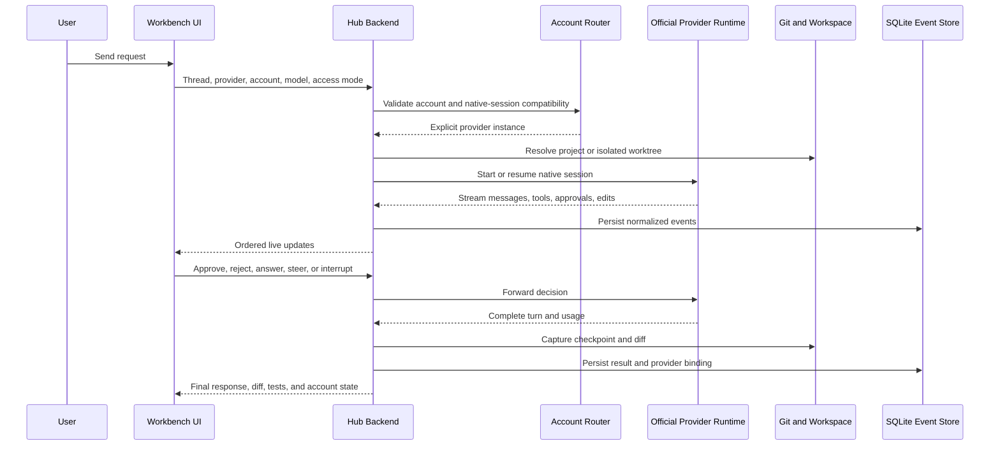

# Unified Coding Workbench

## Audit, feasibility, architecture, and delivery plan

Date: 2026-07-01

> **Superseded:** This document proposed using T3 Code's orchestration layer as
> the foundation. That does not match the clarified requirement that the app be
> a thin client over each provider's existing native harness. Use
> `outputs/native-harness-passthrough-audit.md` as the current architecture.

## Executive verdict

The proposed application is feasible.

The best route is not to extend the current Tkinter Account Hub into a coding
client and not to build a new editor shell from zero. The strongest route is:

1. Fork the MIT-licensed T3 Code project.
2. Keep its Electron, React, local Node.js server, provider adapters, streaming
   event model, terminal, diff, checkpoint, and worktree foundations.
3. Integrate the existing AI Account Hub as an account, quota, history, and
   provider-control subsystem.
4. Use each provider's official local runtime or SDK. Do not imitate private
   web APIs or copy browser cookies.
5. Add native-history discovery and import for providers that expose it.
6. Treat cross-provider continuation as an explicit history bridge, not as a
   claim that all providers share one native conversation.

This produces the requested result: one front-facing desktop application with
projects and threads, while prompts still go directly through Codex, Claude
Code, Cursor, OpenCode, Gemini, or Antigravity using the selected account.

Feasibility rating:

| Scope | Rating | Reason |
|---|---:|---|
| Codex-first coding client | High | Codex app-server is designed for rich custom clients. |
| Codex plus Claude | High | T3 Code already implements both runtimes. |
| Codex, Claude, Cursor, OpenCode | High | Current T3 source already has these provider drivers. |
| Gemini CLI support | Medium-high | Streaming JSON is available, but a new adapter is required. |
| Antigravity support | Medium-high | The official SDK is suitable, but it introduces a Python sidecar. |
| Native history import | High for Codex/Claude | Both expose supported session enumeration and resume APIs. |
| Seamless cross-provider continuation | Medium | It requires an explicit transcript/context bridge. |
| Silent account rotation on limit exhaustion | Rejected | It is risky, misleading, and may circumvent provider limits. |

## What the product should be

Working name: **AI Account Hub Workbench**

It is a local coding-agent control plane, not another model and not a proxy
that resells tokens.

### Main screen

The first screen should be the working application:

```text
+----------------------+--------------------------------------+----------------------+
| Projects and threads | Agent conversation                   | Work context         |
|                      |                                      |                      |
| Project Alpha        | Codex / Account 1 / GPT-5.4         | Changes              |
|  Fix login bug       |                                      | Diff                 |
|  Add billing page    | User request                         | Files                |
|                      | Agent stream                         | Terminal             |
| Project Beta         | Tool calls and approvals             | Plan                 |
|  Review API          | Command output                       | Account and limits   |
|                      |                                      |                      |
| + New project        | [ Attach ] [ Write a request... ]    |                      |
+----------------------+--------------------------------------+----------------------+
```

### Core workflow

1. Select or add a project.
2. Select an existing thread or create a new one.
3. Select a provider, account, model, and access mode.
4. Send the request.
5. The local backend starts or resumes the official provider runtime.
6. Stream messages, plans, tool calls, command output, approvals, and edits.
7. Review the diff and tests.
8. Continue the same native session, fork it, commit it, or open a pull request.

### Account experience

The account chooser should be part of the composer toolbar:

```text
[ Codex ] [ Gmail Login - Ready - Week 71% left ] [ GPT-5.4 ] [ Supervised ]
```

It should show:

- provider and account name
- authenticated identity when safely exposed
- plan
- readiness
- current session or five-hour limit
- weekly limit
- next reset
- active native session binding
- last successful refresh

The usage calendar remains available as an Account Hub view, but it should not
occupy the coding screen by default.

## Current-state audit

### Current machine readiness

Live discovery on this Windows machine found:

| Runtime | Current evidence | Build implication |
|---|---|---|
| Codex | Codex Desktop and its bundled `codex.exe` are installed | Ready for the first provider proof |
| Claude | Claude Desktop and Claude Code `2.1.187` are installed; the CLI is not on the normal `PATH` | Use executable discovery or a configured binary path |
| Antigravity | Antigravity Desktop and an `agy-node.cmd` shim are installed | Desktop is present, but the local CLI shim must be repaired or bypassed |
| Cursor Agent | Not found on `PATH` | Install and authenticate before live adapter tests |
| Gemini CLI | Not found on `PATH` | Install only if the account tier still supports it |
| OpenCode | Not found on `PATH` | Optional installation for the later provider phase |
| T3 Code | Not installed as an application | The audited source fork is the starting point |

The provider adapter architecture can be developed with fixtures, but real
end-to-end acceptance requires the corresponding installed and authenticated
runtime.

### Existing AI Account Hub

The current application is a 4,410-line Tkinter program:

- `outputs/ai-hub-calendar-gui/ai_hub_calendar_gui.py`
- profile metadata in `~/.codex-account-launcher/profiles.json`
- usage and limit history in
  `~/.codex-account-launcher/ai-hub-history.sqlite3`
- Codex app-server rate-limit and usage probes
- Claude authentication, plan, limit, and local-history probes
- Cursor and Antigravity install/login discovery
- account add, edit, rename, sort, and delete controls
- account-aware desktop and CLI launching
- dark/light themes
- online account links
- usage calendar and combined pool statistics

Useful parts to retain:

- provider and executable discovery
- normalized account profile model
- limit parsing and readiness state
- local usage-history schema and migration data
- icons and provider metadata
- account management flows
- manual reset-credit support

Parts not suitable for the new coding client:

- Tkinter rendering and widget lifecycle
- one-file application structure
- synchronous provider/UI coupling
- desktop-process replacement as the primary interaction model
- polling-driven state updates

Conclusion: preserve the data and provider knowledge, not the Tkinter
application architecture.

### T3 Code source audit

Source audited:

- repository: `pingdotgg/t3code`
- version: `0.0.28`
- commit: `7b9eef7ac29f9d4819c6411dfb1c5f04fef50264`
- commit date: 2026-07-01 UTC
- license: MIT
- tracked files: 5,656
- TypeScript/TSX files: 4,104
- test files: 1,145

Important source areas:

| Area | Files | Purpose |
|---|---:|---|
| `apps/server/src/provider` | 103 | Provider drivers, adapters, sessions, and runtime events |
| `apps/server/src/orchestration` | 38 | Commands, event ingestion, projections, and checkpoints |
| `apps/server/src/persistence` | 78 | SQLite stores and repositories |
| `apps/web/src` | 546 | React user interface |
| `apps/desktop/src` | 115 | Electron desktop shell |

Current built-in provider drivers in source:

- Codex
- Claude Agent SDK
- Cursor ACP
- OpenCode SDK
- Grok ACP

Current major capabilities:

- multiple provider instances
- multiple accounts of the same provider
- local WebSocket backend
- ordered typed push events
- streaming messages and tool activity
- in-app approvals and user questions
- SQLite event history
- project and thread read models
- git checkpoints
- turn and full-thread diffs
- integrated terminal
- worktree support
- model selection
- thread resume and rollback
- desktop packaging
- remote-connect code, which can be disabled for a local-only first release

Important audit finding: some architecture documentation is older than the
current implementation. One document still says Codex is the only implemented
provider, while the current source and README contain multiple production
drivers. Source code and tests must be treated as authoritative when the docs
disagree.

### T3 Code multi-account support

T3 Code already solves an important part of the Codex design.

Its Codex provider supports:

- one shared Codex home for sessions, skills, plugins, worktrees, and history
- separate shadow homes containing private account authentication
- symlinks from each shadow home into the shared non-secret state
- a common continuation identity so an existing thread can be resumed with a
  compatible account

This is more suitable than the Account Hub's current fully separate Codex
homes when the goal is shared project history.

The shadow-home implementation deliberately keeps `auth.json` and model cache
private while sharing sessions and other compatible state. It should be
adopted only after backup and migration tests on Windows.

Claude instances can also be separated by home directory, but different
Claude homes are not naturally continuation-compatible. A change of Claude
account should normally fork or bridge the thread.

## Recommended technology

### Desktop and frontend

- Electron for the Windows desktop shell
- React 19 and TypeScript
- Vite for the web build
- the existing T3 design system and component foundation
- Lucide icons for generic actions
- official provider artwork for provider identity
- xterm.js for the integrated terminal
- a structured diff viewer rather than text-only patches

Why not Python/Tkinter:

- weak fit for high-frequency streaming UI
- harder virtualized thread lists and rich markdown
- harder terminal, diff, drag/drop, and multi-pane interaction
- the existing flashing and layout problems would become more severe

Why not C++:

- no practical benefit for this workload
- much higher UI and integration development cost
- every provider SDK is easier to consume from TypeScript or Python

Python remains useful as an isolated sidecar for the Antigravity SDK.

### Local backend

Use T3 Code's local Node.js backend and provider-driver interface.

The backend owns:

- provider process lifecycle
- account-specific environment variables
- native session IDs
- normalized streaming events
- approvals
- history projection
- usage refresh
- git/worktree lifecycle
- terminal processes
- secret redaction

### Persistence

Use SQLite for durable application state:

- projects
- hub threads
- provider bindings
- turns and normalized events
- imported native-session metadata
- worktrees and checkpoints
- account profiles without raw tokens
- usage and limit snapshots
- UI settings

Keep provider-native histories in their original locations. The database stores
references and normalized projections, not replacement copies required for
native resume.

## Provider integration matrix

### Codex

Recommended interface: `codex app-server` over stdio.

Supported product behavior:

- list, read, start, resume, fork, archive, and interrupt threads
- start and steer turns
- stream agent messages and tool events
- handle approvals and structured user questions
- read account and rate limits
- read provider usage
- consume a reset credit only after explicit confirmation
- preserve CLI/Desktop-compatible Codex history

This is the best first provider because app-server is explicitly intended for
rich custom clients with authentication, history, approvals, and streamed
events.

### Claude Code

Recommended interface: `@anthropic-ai/claude-agent-sdk`.

Supported product behavior:

- direct Claude Code agent loop
- streaming messages and tools
- permissions and user questions
- capture and resume session IDs
- fork sessions
- list existing sessions
- read past session messages
- rename and tag sessions
- preserve native local JSONL histories

The `cwd` must match when resuming native sessions. The hub must store the
resolved project path alongside each Claude session binding.

### Cursor

Recommended interface: `cursor-agent acp`.

T3 Code already contains an ACP runtime and Cursor-specific extension support.
This provides a better base than terminal-screen scraping.

Expected behavior:

- start and continue agent sessions
- stream assistant and tool events
- model discovery
- approvals and user questions
- local edits and terminal actions

Native history import depends on what the installed Cursor ACP build exposes.
Hub-created Cursor threads are feasible now; importing every old Cursor IDE
chat must be a separate proof-of-concept.

### OpenCode

Recommended interface: official OpenCode SDK.

T3 Code already contains the provider driver. Retain it because it is a useful
open provider and a strong adapter test case.

### Gemini CLI

Recommended interface: headless mode with
`--output-format stream-json`.

The stream exposes:

- session metadata
- message chunks
- tool use
- tool results
- errors
- final results and token statistics

Limitations:

- a new provider adapter is required
- approval and resume behavior must be tested against the installed version
- consumer Gemini CLI availability changed in June 2026, so Google consumer
  users should generally be guided toward Antigravity

### Antigravity

Recommended interface: official Google Antigravity Python SDK.

The SDK exposes:

- an embeddable local agent
- streaming
- built-in coding tools
- declarative safety policies
- lifecycle hooks
- human-in-the-loop questions
- subagents
- usage and observability

Integration shape:

1. Package a small Python sidecar.
2. Communicate with it over local NDJSON stdio.
3. Normalize its stream into the same provider event schema.
4. Keep Google credentials in the provider's supported store.

Do not automate the interactive TUI with keystrokes. The local `agy-node.cmd`
installation currently fails with an ICU descriptor error, so the CLI path
must be repaired or bypassed with the SDK before this provider can pass an
end-to-end test.

## History design

There are three different kinds of history. They must not be conflated.

### 1. Native provider history

The history stored and understood by the provider runtime:

- Codex threads under the selected/shared `CODEX_HOME`
- Claude session JSONL under the selected Claude home and project path
- Cursor ACP sessions where exposed
- Gemini/Antigravity sessions where exposed

This is what enables true native resume with full provider context.

### 2. Hub history

The normalized transcript and events shown in the GUI:

- user messages
- assistant messages
- plans
- tool calls and outcomes
- command output
- approvals
- file edits
- diffs and checkpoints
- usage snapshots

This survives application restarts and gives one consistent UI.

### 3. Cross-provider bridge

A provider cannot normally resume another provider's private native context.

When the user changes provider in an existing thread, the hub should offer:

- **Continue natively**: only compatible provider/account instances
- **Fork to provider**: create a new provider session with a structured context
  packet
- **Start clean**: same project and files, no transcript bridge

The context packet should contain:

- user-approved thread summary
- recent user and assistant turns
- current task and unresolved decisions
- current git diff
- test results
- relevant file references

The UI must label a bridged thread. It should never imply that a Claude session
became a Codex session without context loss.

## Native history import plan

### Codex importer

1. Discover configured Codex homes.
2. Call `thread/list`.
3. Store thread metadata and native ID.
4. Lazily call `thread/read` when opened.
5. Resume through `thread/resume`.
6. Deduplicate by native provider, shared home, and thread ID.

### Claude importer

1. Enumerate each configured Claude home.
2. Call `listSessions({ dir: projectPath })`.
3. Store session ID, summary, project path, branch, and timestamps.
4. Lazily call `getSessionMessages`.
5. Resume with the exact session ID and matching `cwd`.
6. Keep separate-home sessions bound to their original account.

### Other providers

- import only through documented APIs or formats
- do not decrypt browser databases
- do not scrape private network requests
- mark unsupported native histories as unavailable
- hub-created threads still remain fully available in Hub history

## Account routing and limits

### Safe routing model

The account panel may rank accounts by:

- authenticated and healthy
- compatible with the current native session
- enough known session and weekly allowance
- selected by the user
- last used

The final account choice must be visible.

### Limit event behavior

When an account becomes unavailable:

1. Stop sending new turns to that account.
2. Preserve the unfinished thread and runtime result.
3. Show the provider error and reset time.
4. Offer compatible accounts as explicit choices.
5. If switching breaks native continuity, offer a labelled fork with a context
   bridge.

The application should not silently rotate accounts to evade rate limits. This
also prevents a task from unexpectedly running under the wrong organization,
billing context, data policy, or account history.

## Request lifecycle



## Proposed internal modules

```text
apps/
  desktop/                 Electron shell
  web/                     React workbench
  server/                  Local orchestration backend

packages/
  contracts/               Typed commands, events, and schemas
  account-hub/             Profiles, readiness, limits, usage history
  provider-codex/          Codex app-server adapter
  provider-claude/         Claude Agent SDK adapter
  provider-cursor/         Cursor ACP adapter
  provider-opencode/       OpenCode adapter
  provider-gemini/         Gemini stream-json adapter
  provider-antigravity/    TypeScript client for Python sidecar
  history-import/          Native-session discovery and projection
  project-runtime/         Worktrees, checkpoints, terminal, and diffs
  secret-store/            OS-backed secret references

sidecars/
  antigravity/             Official Python SDK bridge
```

Provider adapters should implement one common contract:

```ts
interface CodingProviderAdapter {
  probeAccount(): Promise<AccountSnapshot>;
  listNativeSessions(project: ProjectRef): Promise<NativeSessionSummary[]>;
  readNativeSession(id: string): Promise<NormalizedThread>;
  startSession(input: StartSessionInput): Promise<SessionHandle>;
  resumeSession(input: ResumeSessionInput): Promise<SessionHandle>;
  sendTurn(input: SendTurnInput): AsyncIterable<ProviderEvent>;
  respondToApproval(input: ApprovalDecision): Promise<void>;
  interruptTurn(input: InterruptInput): Promise<void>;
  stopSession(input: StopSessionInput): Promise<void>;
}
```

Provider-specific features remain capability flags rather than being forced
into a false universal API.

## Security audit

### Required defaults

- local-only server bound to loopback
- supervised mode by default
- workspace-write sandbox by default
- explicit approval for commands outside safe policy
- explicit approval for network access where the runtime supports it
- one provider process environment per account instance
- one worktree per concurrent editing thread
- secrets never returned to the renderer
- sensitive environment variables redacted from logs
- browser cookies never copied or decrypted
- native auth stores treated as opaque secrets

### Change from T3 defaults

T3 documents full access as its default runtime mode. The fork should reverse
that:

- default: supervised and workspace-write
- optional: full access, visibly enabled per thread

### Local versus remote

T3 contains remote access, relay, Clerk, SSH, and Tailscale support. The first
release should disable remote access and cloud login by default. Reintroduce it
only after:

- authenticated WebSocket review
- CSRF/origin review
- secret-store review
- relay threat model
- audit logging
- remote approval UX

### Provider updates

Provider CLIs and SDKs change independently. Each adapter requires:

- version probe
- minimum and tested version range
- generated protocol schemas where available
- fixture-based event compatibility tests
- graceful unsupported-version message
- provider process timeout and restart policy

## Policy boundary

Using multiple accounts owned by the same person as explicitly selected
provider instances is technically possible.

The product must not be designed to circumvent limits. OpenAI's terms prohibit
circumventing rate limits or restrictions. Therefore:

- no silent retry on the next account after a limit response
- no virtual combined quota presented as one provider entitlement
- no hidden token rotation
- no account credential sharing
- no browser-session extraction
- no claim that the Hub grants more provider usage

The combined dashboard can remain an informational capacity view. Starting a
turn always names the actual account.

## Migration from the current Account Hub

### Profile migration

Build a one-time importer for:

- `~/.codex-account-launcher/profiles.json`

Map:

- profile ID
- display name
- provider
- provider home
- workspace
- browser preference
- online links
- current plan and identity metadata

Do not copy cached errors as permanent state.

### Usage migration

Import or attach read-only to:

- `~/.codex-account-launcher/ai-hub-history.sqlite3`

Preserve:

- daily usage buckets
- limit snapshots
- reset timestamps
- provider source and confidence

The migration must be idempotent and retain the original database as a backup.

### Codex home migration

The current profiles use separate Codex homes. The target can use:

- one shared home for native sessions and common configuration
- one shadow home per account for private authentication

Migration needs:

1. Full backup of all Codex homes.
2. Duplicate thread detection by native thread ID and file hash.
3. Shared-home dry run.
4. Validation that each shadow retains its own authenticated identity.
5. Read/resume test against one thread per account.
6. Rollback command.

Do not merge authentication files.

## Delivery plan

### Phase 0: Product and source baseline

Estimate: 2 to 3 working days

Deliverables:

- create a clean fork at the audited T3 commit
- rename application IDs and data directories
- write the upstream merge policy
- decide local-only first release
- capture current Account Hub profile and database backups
- define supported provider versions
- create end-to-end fixture projects

Exit gate:

- fork builds and launches on this Windows machine
- upstream remains a separate Git remote
- no Account Hub data has been modified

### Phase 1: Codex-first Workbench

Estimate: 1 to 2 weeks

Deliverables:

- polished projects and threads shell
- Codex provider instances for all configured accounts
- shared-home plus shadow-auth proof-of-concept on Windows
- native Codex history discovery and resume
- message streaming, approvals, user questions, and interruption
- terminal, diff, checkpoints, and worktree flow
- supervised mode as default

Exit gate:

- complete a real multi-turn Codex coding task without opening Codex Desktop or
  a separate terminal
- close and reopen the Workbench, then resume the same native thread
- verify the exact selected account before and after the run

### Phase 2: Account Hub integration

Estimate: 1 to 2 weeks

Deliverables:

- profile and usage-history importer
- account chooser in the composer
- readiness and quota cards
- Account Hub calendar as a separate view
- background limit refresh without full UI rerenders
- explicit account-switch and fork flow
- reset-credit confirmation flow

Exit gate:

- existing profiles and history appear without losing source data
- no flashing or selection coupling
- account status updates do not interrupt active typing or streaming

### Phase 3: Claude and Cursor

Estimate: 1.5 to 3 weeks

Deliverables:

- Claude Agent SDK provider in the unified runtime
- Claude native session listing, reading, resume, fork, rename, and tags
- Claude plan and usage integration
- Cursor ACP provider validation on Windows
- Cursor provider installation/login guidance
- capability-aware model and approval controls

Exit gate:

- complete and resume a real Claude task
- import at least one existing Claude project session
- complete a Cursor task if Cursor Agent is installed and authenticated

### Phase 4: OpenCode and Google providers

Estimate: 1.5 to 3 weeks

Deliverables:

- preserve and test OpenCode support
- Gemini streaming JSON adapter if the account tier remains supported
- Antigravity SDK sidecar
- Google account, credit, and quota status
- provider capability matrix in settings

Exit gate:

- each enabled provider passes start, stream, tool, approval, interrupt, edit,
  restart, and resume tests, or is clearly marked with its unsupported
  capabilities

### Phase 5: Hardening and release

Estimate: 1.5 to 2 weeks

Deliverables:

- crash recovery
- process cleanup
- database backup and repair flow
- adapter compatibility fixtures
- security review
- installer and automatic update channel
- Windows signing
- diagnostics export with secret redaction
- user documentation

Exit gate:

- clean install, upgrade, uninstall, and data-preservation tests pass
- no raw access or refresh token appears in logs or renderer state
- a provider update fails gracefully rather than corrupting a thread

## Schedule

For one experienced TypeScript/Electron engineer working with Codex:

| Target | Estimate |
|---|---:|
| Codex-only working MVP | 2 to 3 weeks |
| Codex + Claude + Account Hub MVP | 3 to 5 weeks |
| Cursor/OpenCode and history polish | 5 to 8 weeks total |
| Google providers, hardening, signed release | 8 to 12 weeks total |

Allow 10 to 14 weeks if the goal is public distribution quality rather than a
personal Windows build.

These are engineering estimates, not guarantees. Provider compatibility and
Windows shadow-home behavior are the main schedule risks.

## Who can build it

### Minimum team

- **Product owner:** the user, deciding workflow, names, account behavior, and
  acceptance criteria
- **Lead implementation:** Codex can perform most repository audit,
  implementation, tests, migration work, and documentation in this workspace
- **Engineering oversight:** one senior TypeScript/Electron engineer, which can
  be the same person operating Codex if they can review architecture and
  security decisions
- **Security review:** a focused independent review before remote access or
  public distribution

### Helpful optional roles

- product designer for final interaction polish
- Windows packaging specialist for signing and installer edge cases
- provider-specific tester with authenticated Cursor and Google accounts

This does not require a large team for a personal tool. It does require
disciplined provider tests because the external runtimes change often.

## Cost shape

- T3 Code source license cost: none, MIT licensed
- new token resale fee: none
- provider usage: existing subscriptions or the user's own API billing
- local database and backend: no hosting cost
- optional remote relay: hosting and identity-provider cost
- public Windows release: code-signing and distribution cost
- development: primarily engineering time

The Workbench should make the actual provider and account visible on every
turn so billing and plan use remain understandable.

## Major risks and mitigations

| Risk | Impact | Mitigation |
|---|---|---|
| T3 is alpha and changes quickly | Merge conflicts and regressions | Pin a known commit and isolate custom packages. |
| Provider protocol drift | Broken streams or resume | Version gates and recorded fixtures per adapter. |
| Tkinter logic copied directly | UI coupling and lag | Port data/services only. |
| Shared Codex home migration error | Lost or mixed history | Backup, dry run, dedupe, identity checks, rollback. |
| Cross-provider context loss | Misleading continuation | Explicit fork/bridge labels and context preview. |
| Concurrent agents edit one tree | Conflicts and corruption | One worktree per editing thread. |
| Full access by default | Host compromise risk | Supervised workspace-write default. |
| Renderer sees secrets | Credential exposure | Backend-only secret references and redaction. |
| Silent account failover | Policy and billing risk | Explicit user confirmation and named account per turn. |
| Provider limit data unavailable | False readiness | Show source, timestamp, and unknown state. |
| Antigravity CLI currently broken | Google provider blocked | Use SDK sidecar or repair install before enablement. |

## Acceptance criteria

The first serious release is complete only when all of these pass:

1. Add a real project and display its existing threads.
2. Import and resume an existing Codex thread.
3. Import and resume an existing Claude session.
4. Send a new request through the selected native provider account.
5. Stream assistant text, plans, tools, commands, and edits without UI flashing.
6. Approve, reject, answer, steer, and interrupt from the GUI.
7. Review a turn diff and full-thread diff.
8. Run and inspect tests in the integrated terminal.
9. Close and reopen the app without losing the thread or provider binding.
10. Keep concurrent editing threads isolated in worktrees.
11. Display readiness, plan, session limit, weekly limit, and reset source where
    exposed.
12. Never display or log raw authentication secrets.
13. Require explicit confirmation before changing accounts after a limit.
14. Survive one supported provider CLI update in compatibility testing.
15. Preserve and roll back the original Account Hub data migration.

## Recommended first implementation decision

Build a local-only T3 Code fork in a new workspace and make Codex plus Claude
the first supported providers.

Do not start by:

- redesigning Tkinter again
- building a C++ shell
- adding all providers simultaneously
- enabling remote access
- importing every history format
- implementing silent account pooling

The first proof should demonstrate one decisive workflow:

> Open one app, select a project and existing Codex or Claude thread, send a
> real coding request through the chosen account, review the streamed work and
> diff, close the app, then reopen and continue the exact native session.

Once that works, the Account Hub calendar, additional providers, and bridge
mode become contained additions rather than bets on an unfinished foundation.

## Research sources

- T3 Code repository and architecture:
  https://github.com/pingdotgg/t3code
- T3 Code product:
  https://t3.codes/
- Codex app-server:
  https://developers.openai.com/codex/app-server/
- Codex SDK:
  https://developers.openai.com/codex/sdk/
- Claude Agent SDK sessions:
  https://code.claude.com/docs/en/agent-sdk/sessions
- Claude Agent SDK TypeScript:
  https://code.claude.com/docs/en/agent-sdk/typescript
- Gemini CLI headless mode:
  https://google-gemini.github.io/gemini-cli/docs/cli/headless.html
- Antigravity CLI:
  https://antigravity.google/docs/cli-overview
- Antigravity SDK:
  https://antigravity.google/docs/sdk-overview
- Antigravity plans:
  https://antigravity.google/docs/plans
- OpenAI Terms of Use:
  https://openai.com/policies/terms-of-use/
- OpenAI account sharing policy:
  https://help.openai.com/en/articles/10471989-openai-account-sharing-policy
